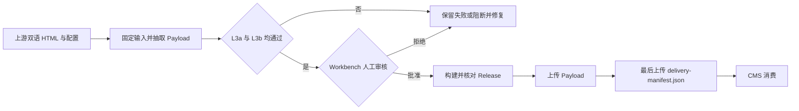

# AzureCNArchaeologist

AzureCNArchaeologist 将 Azure 中国 Pricing 页面和 SLA、ICP、LEGAL、PSR 支持文章的中英文 HTML，抽取为下游 CMS 可消费的 Business Payload。系统负责输入固定、内容抽取、独立机器验证、Workbench 人工审核、Release 封存和 Azure Blob 交付；CMS 负责消费交付结果并导入内容。

本文是项目介绍和日常运行手册。产品支持范围、待处理事项和变更记录统一维护在 [产品状态表](tracking-product-status.md)，实现合同见 [文档索引](docs/README.md)。

## 目录

- [模块与数据](#模块与数据)
- [环境准备](#环境准备)
- [完整工作流](#完整工作流)
- [上游 HTML 变更后的增量流程](#上游-html-变更后的增量流程)
- [失败与重新处理](#失败与重新处理)
- [Blob 与 CMS 交付约定](#blob-与-cms-交付约定)
- [测试与维护](#测试与维护)

## 模块与数据

### 代码模块

| 模块 | 职责 |
|---|---|
| `cli.py` / `src/cli.py` | 命令行入口，选择处理范围并调用各阶段服务。 |
| `src/core/` | 产品目录、双语源定义、Payload 合同与公共规则。 |
| `src/pipeline/` | 固定输入，编排抽取、检查、Batch 封存及中断恢复。 |
| `src/strategies/` / `src/extractors/` | 按页面策略抽取业务内容并生成 Payload。 |
| `src/machine_checks/` | L3a 重复抽取检查，以及独立于生产抽取逻辑的 L3b 源内容核对。 |
| `src/incremental/` | HTML 与配置变化检测、增量批次状态、程序修复后的重新处理。 |
| `src/review/` / `dashboard/` | 审核材料、产品级双语 Workbench 和真实人工决定。 |
| `src/release/` | 从有效批准记录构建并核对不可覆盖的 Full / Delta Release。 |
| `src/delivery/` | 将指定 Release 上传 Blob，最后发布交付清单。 |

抽取策略由产品配置决定：`simple_static` 用于静态定价正文，`region_filter` 用于区域筛选页面，`complex` 用于复杂内容组合，`support_article` 用于支持文章。具体边界见 [Strategy 说明](docs/specs/m3-strategy-boundaries.md)。

### 输入、配置与产物

| 路径 | 用途 |
|---|---|
| `data/current_prod_html/` | 上游最新完整快照：`zh-cn/`、`en-us/` 和 `soft-category.json`。 |
| `data/configs/processing-scope.json` | 正式处理范围；`--all` 不代表处理目录中所有参考配置。 |
| `data/configs/products-config/` | 双语源路径、页面模型、Strategy 和产品特定抽取边界。 |
| `data/prod-html/` / `data/configs/soft-category.json` | 已固定的 HTML 与可信区域映射对比基线。 |
| `data/state/` | Product Definition 对比基线、配置使用证据及增量人工终结记录。 |
| `runs/{run-name}/` | 一次 Batch 的清单、Payload、机器报告；增量批次另存独立 `inputs/`。 |
| `reviews/{review-id}/` | 审核清单、材料和不可覆盖的人工决定。 |
| `releases/{release-id}/` | 已封存 Payload、`release-manifest.json` 和批准决定副本。 |

`soft-category.json` 的 `tableIDs` 是表格排除清单，不是保留清单。处理相关配置变化也必须经过增量检测、机器检查和人工审核；不要手工提前改写对比基线来消除差异。

## 环境准备

需要 Git、Python 3.10+、uv；Workbench 另需 Node.js 22.13+ 和 npm。以下命令在项目根目录执行，示例使用 Bash / zsh。

```bash
uv sync --extra dev
npm --prefix dashboard ci
uv run python cli.py --help
```

仅 Blob 上传需要凭据。已有 `.env` 时不要覆盖：

```bash
test -e .env || cp .env_example .env
```

在 `.env` 中配置以下两项，真实值不得提交到 Git、日志或文档：

```dotenv
AZURE_STORAGE_CONNECTION_STRING=<真实连接串>
AZURE_BLOB_CONTAINER_NAME=<已创建的目标容器>
```

进程环境变量优先于 `.env`。容器由运维预先创建，程序不会创建容器或修改权限。

## 完整工作流


```mermaid
flowchart LR
    A[上游双语 HTML 与配置] --> B[固定输入并抽取 Payload]
    B --> C{L3a 与 L3b 均通过}
    C -- 否 --> D[保留失败或阻断并修复]
    C -- 是 --> E{Workbench 人工审核}
    E -- 拒绝 --> D
    E -- 批准 --> F[构建并核对 Release]
    F --> G[上传 Payload]
    G --> H[最后上传 delivery-manifest.json]
    H --> I[CMS 消费]
```

一个产品始终同时处理 `zh-cn` 和 `en-us`。L3a 检查重复抽取是否一致，L3b 独立核对源内容与业务 HTML 字段；机器通过不代表内容已获人工批准。

以下演示正式范围的全量运行。已发布产品的日常上游变化使用下一节的增量流程，不要用全量运行代替变化检测。运行、审核、Release ID 均只写一次，使用小写字母、数字和单连字符，不能删除旧目录来复用名称。

### 1. 准备输入并运行

将完整双语快照及可信配置放入 `data/current_prod_html/`，路径必须与产品配置一致。不要手改 Frozen HTML、Payload 或机器报告。

在同一终端保留以下变量，后续步骤继续使用；若更换终端，应恢复本轮实际 ID，而不是重新生成。

```bash
FLOW_RUN="full-$(date +%Y%m%d-%H%M%S)"
FLOW_REVIEW="${FLOW_RUN}-review"

uv run python cli.py run --all --run-name "$FLOW_RUN" --parallel-jobs 4
uv run python cli.py status --run-name "$FLOW_RUN"
```

核对计划数、通过数、失败和阻断原因。`--parallel-jobs` 支持 2–32；定向运行可将 `--all` 换成 `--product`、`--products` 或 `--category`，范围仍受正式 Scope 约束。

### 2. 创建审核并进入 Workbench

```bash
uv run python cli.py review-prepare --run-name "$FLOW_RUN" --review-id "$FLOW_REVIEW"
```

只有中英文抽取、L3a、L3b 全部通过的产品才能入队；不符合条件的项保留原因，不能靠人工批准绕过机器门槛。

另开一个终端，在项目根目录启动前端并保持运行：

```bash
npm --prefix dashboard run dev
```

回到保留本轮变量的终端，启动审核服务：

```bash
uv run python cli.py review-serve --review-id "$FLOW_REVIEW" --port 0
```

使用服务输出的完整 URL 进入 Workbench；URL 带临时令牌，不要只打开 `/review`，也不要对外分享令牌。真实审核人需检查中英文 Frozen HTML、Payload、L3a / L3b 材料及业务完整性，再提交产品级批准或拒绝。

审核完成后，在该终端按 `Ctrl+C` 停止审核服务，然后查看决定：

```bash
uv run python cli.py review-status --review-id "$FLOW_REVIEW"
```

### 3. 构建、核对并上传

确认有有效批准项后再执行：

```bash
FLOW_RELEASE="full-release-$(date +%Y%m%d-%H%M%S)"
uv run python cli.py release-build --kind full --review-id "$FLOW_REVIEW" --release-id "$FLOW_RELEASE"
uv run python cli.py release-verify --release-id "$FLOW_RELEASE"
```

确认核对通过、Release 中的产品及数量符合交付预期，再上传：

```bash
uv run python cli.py release-upload --release-id "$FLOW_RELEASE" --json
```

`full` 指当前审核队列的全部有效批准产品，不一定覆盖整个正式 Scope；普通定向批次也使用它。不同审核 ID 分别构建 Release，不能复制人工决定或伪造增量绑定。拒绝、待审和未入队项不会进入 Release。

保留上传成功输出，并确认目标目录存在 `delivery-manifest.json`；本地 Release 核对通过本身不代表 Blob 已交付。

## 上游 HTML 变更后的增量流程

适用于已经纳入正式范围的产品。新结果仍需完整双语机器检查、新的人工批准和新的 Release，不会自动替换已发布内容。

### 1. 确认旧批次已处理完，再更新上游快照

```bash
uv run python cli.py incremental-status
```

同一时间只允许一个未结束增量 Batch。若仍有未解决产品，先按下一节完成恢复、修复或真实人工终结决定，不要另起 `run --changed`；还需确认上一轮 Release 已完成 Blob 上传，不能只看本地批次状态。

更新 `data/current_prod_html/` 内变化的 HTML 和配置，同时保留未变化文件，使目录仍是完整快照。此时不要运行 `source-input`，不要改写 `data/prod-html/`、可信映射或定义对比基线，否则可能抹掉需要检测的差异。

### 2. 查看变化计划并执行

```bash
uv run python cli.py changes --json
```

该命令只读比较上游 HTML、`soft-category.json` 业务映射及 Product Definition 的处理相关字段。任一语言或相关配置变化，都会将该产品的中英文一起纳入计划。`html-changes` 仅比较 HTML，不能替代完整检测。

`no_changes` 只说明输入与处理基线没有业务差异，不说明已有 Payload 是否上传。确认计划符合预期后运行：

```bash
FLOW_RUN="upstream-change-$(date +%Y%m%d-%H%M%S)"
FLOW_REVIEW="${FLOW_RUN}-review"

uv run python cli.py run --changed --run-name "$FLOW_RUN" --parallel-jobs 4 --json
```

若运行结果为 `batch_created: false`，没有创建空 Batch，应跳过 `status` 及后续审核、发布步骤。本次实际采用的 HTML 和配置会固定在增量 Batch 的 `inputs/` 中，后续全局源变化不会改写它。

### 3. 完成新的人工审核

确认已创建并封存增量 Batch 后执行：

```bash
uv run python cli.py status --run-name "$FLOW_RUN"
uv run python cli.py review-prepare --run-name "$FLOW_RUN" --review-id "$FLOW_REVIEW"
uv run python cli.py review-serve --review-id "$FLOW_REVIEW" --port 0
```

确保 Workbench 前端仍在运行，按完整工作流检查两个语言并提交真实决定。历史批准不能沿用。审核结束后停止审核服务，再查看 `review-status`。

### 4. 创建 Delta Release 并增量上传

```bash
FLOW_RELEASE="delta-release-$(date +%Y%m%d-%H%M%S)"
uv run python cli.py release-build --kind delta --review-id "$FLOW_REVIEW" --release-id "$FLOW_RELEASE"
uv run python cli.py release-verify --release-id "$FLOW_RELEASE"
```

核对通过且范围正确后上传：

```bash
uv run python cli.py release-upload --release-id "$FLOW_RELEASE" --json
uv run python cli.py incremental-status
```

`delta` 仅适用于 `run --changed` 生成的增量 Batch 及其重新处理链。它只包含本批次当前获批、尚未进入既有 Delta Release 的产品；其余产品不重传。同一 Batch 可分次发布，后续获批产品使用新的 Release ID。

所有受影响产品进入已封存 Delta Release，或被真实审核人明确结束而不交付后，增量 Batch 才结束。这个状态按本地记录计算，不检查 Blob；仍须逐份核对上传成功和远端完成清单。

## 失败与重新处理

| 情况 | 处理方式 |
|---|---|
| 进程中断，存在 `{run-name}.building` | 使用 `resume --run-name` 继续原运行；已封存 Batch 不能使用 `resume`。 |
| HTML 缺失、结构或映射不明确 | 保留失败或阻断，反馈上游确认，不猜测内容或绕过验证。 |
| 普通全量或定向 Batch 失败、被拒绝 | 修复后使用新的运行名和审核 ID；不得改写旧产物。 |
| 增量批次中发现程序错误 | 修复代码后，在原 Batch 的固定输入上追加重新处理记录。 |
| 未结束增量批次又收到新 HTML 或处理配置 | 不能用程序修复命令替换固定输入；先解决旧批次，必要时由真实审核人明确结束旧产品而不交付，再进行下一轮变化检测。 |
| 上传失败，留下不完整 Blob 目录 | 没有完成清单的目录不能被 CMS 消费。保留错误，由维护者核查前缀；不要盲目重传、覆盖或手工补清单。 |

程序修复后的增量重新处理示例；姓名和原因必须填写真实信息，产品键替换为本批次实际未解决产品：

```bash
FIX_RUN="product-reprocess-$(date +%Y%m%d-%H%M%S)"
FIX_REVIEW="${FIX_RUN}-review"

uv run python cli.py incremental-reprocess-product \
  --run-name "$FLOW_RUN" --product service-bus \
  --new-run-name "$FIX_RUN" \
  --requested-by "实际发起人姓名" --reason "程序问题及修复原因"

uv run python cli.py review-prepare --run-name "$FIX_RUN" --review-id "$FIX_REVIEW"
```

若最新机器结果已通过但被人工拒绝，重新处理命令必须额外提供 `--rejected-review-id`，指向拒绝最新结果的审核 ID；机器失败时不需要该参数。随后审核 `$FIX_REVIEW`，用它构建新的 `delta` Release 并上传，只有处理链中的最新结果可交付。

需要明确结束某个产品而不交付时，由真实审核人执行以下命令并填写真实身份及理由；普通拒绝不会自动结束产品：

```bash
uv run python cli.py incremental-end-product \
  --run-name "$FLOW_RUN" --product service-bus \
  --reviewer "真实审核人姓名" --reason "本轮明确结束且不交付的理由"
```

详细限制与重新处理规则见 [增量处理规格](docs/specs/incremental-processing.md)。

## Blob 与 CMS 交付约定

```text
{container}/
└── YYYY-MM-DD/                  实际上传日期，使用上传机器本地时区
    └── {release-id}/            带时间戳，每次发布使用新 ID
        ├── payloads/
        │   ├── zh-cn/...
        │   └── en-us/...
        └── delivery-manifest.json
```

上传服务再次核对 Release，只上传清单内的 Payload，全部成功后最后写入 `delivery-manifest.json`。本地 `release-manifest.json`、人工决定和 Run / Review 引用链不上传。

CMS 只消费存在完成清单的目录；同一天多个 Release 共用日期前缀，通过各自 Release ID 中的时间戳判断先后。同一产品再次获批发布后，CMS 消费最新有效版本。历史 Blob 不覆盖，当前也没有产品下线或自动删除语义。

上传日期与 Release 创建日期可以不同。保存命令返回的实际 Blob 前缀和成功记录；同一路径已存在时上传会报错，当前不支持跳过已有文件或覆盖重试。详见 [Blob 发布规格](docs/specs/blob-delivery.md)。

## 测试与维护

```bash
uv run pytest
npm --prefix dashboard test
npm --prefix dashboard run build
git diff --check
```

部分 [Workbench 测试](tests/test_m5_workbench.py)依赖本地 Run / Review fixture；全新 checkout 缺少材料时，需从可信内部备份恢复并记录测试限制，不伪造审核决定。

`runs/`、`reviews/`、`releases/` 默认被 Git 忽略，但属于相互引用的审计材料，不是临时缓存；`release-verify` 仍依赖它们，应统一备份，不能随意删除。不要提交 `.env`、连接串、临时审核令牌或其他凭据。

新增正式产品须完成抽取验证和人工审核，并同步 Scope、Product Definition 基线与 [产品状态表](tracking-product-status.md)。本手册不重复维护产品数量、历史批次或交付记录。

更多细节见 [核心 Pipeline](docs/specs/core-pipeline.md)、[机器检查](docs/specs/machine-checks.md)、[人工审核与 Release](docs/specs/m5-review-release.md)；命令参数可用 `uv run python cli.py <命令> --help` 查询。
