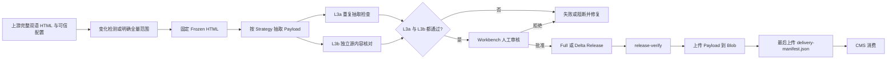

# AzureCNArchaeologist

AzureCNArchaeologist 是 Azure 中国定价页与支持文章的双语内容抽取和交付系统。它从上游 HTML 与可信配置开始，生成 CMS Business Payload，完成两项独立机器检查、真实人工审核、不可覆盖的 Release，并把最终 Payload 发布到 Azure Blob Storage。

本文是项目的首要运行手册。新员工应先读完“关键规则”和“环境准备”，再执行全量或增量流程。更细的实现合同位于 [`docs/`](docs/README.md)。

## 目录

- [当前生产基线](#当前生产基线)
- [端到端工作流](#端到端工作流)
- [关键概念](#关键概念)
- [必须遵守的规则](#必须遵守的规则)
- [环境准备](#环境准备)
- [目录与配置](#目录与配置)
- [运行名称规范](#运行名称规范)
- [全量处理流程](#全量处理流程)
- [增量处理流程](#增量处理流程)
- [失败、拒绝与重新处理](#失败拒绝与重新处理)
- [Release 与 Blob 发布](#release-与-blob-发布)
- [测试与开发检查](#测试与开发检查)
- [CLI 命令速查](#cli-命令速查)
- [安全与数据保留](#安全与数据保留)
- [进一步阅读](#进一步阅读)

## 当前生产基线

以下状态截至 2026-08-26，详细产品级状态见 [`tracking-product-status.md`](tracking-product-status.md)。

| 项目 | 当前值 |
|---|---:|
| `processing-scope.json` 正式产品 | 184 |
| 中文和英文处理项 | 368 |
| 人工审核批准 | 181 个产品 |
| 人工审核拒绝、等待上游修复 | 3 个产品 |
| 待审核 | 0 |
| 已批准 Pricing | 83 |
| 已批准 Support Article | 98 |

当前拒绝产品为：

- `anomaly-detector`
- `hdinsight`
- `web-pubsub`

它们仍保留在正式范围与 Product Definition 基线中，以便上游修复后被增量检测选中，但不会进入未获批准的 Release。

最新成功交付：

| 字段 | 值 |
|---|---|
| Release ID | `supported-products-expanded-full-release-20260826-021215` |
| Release 类型 | `full` |
| 已交付产品 | 181 |
| Payload | 362 |
| Blob 容器 | `cms-output` |
| Blob 前缀 | `2026-08-26/supported-products-expanded-full-release-20260826-021215/` |
| 远端文件 | 362 个 Payload + 1 个 `delivery-manifest.json` |

## 端到端工作流


```mermaid
flowchart LR
    A[上游完整双语 HTML 与可信配置] --> B[变化检测或明确全量范围]
    B --> C[固定 Frozen HTML]
    C --> D[按 Strategy 抽取 Payload]
    D --> E[L3a 重复抽取检查]
    D --> F[L3b 独立源内容核对]
    E --> G{L3a 与 L3b 都通过?}
    F --> G
    G -- 否 --> H[失败或阻断并修复]
    G -- 是 --> I[Workbench 人工审核]
    I -- 拒绝 --> H
    I -- 批准 --> J[Full 或 Delta Release]
    J --> K[release-verify]
    K --> L[上传 Payload 到 Blob]
    L --> M[最后上传 delivery-manifest.json]
    M --> N[CMS 消费]
```

任何机器失败、机器阻断、人工拒绝或待审核状态都不能越过对应门槛。Pipeline 没有自动批准，也不会因为某一步“没有抛异常”就把产品视为可发布。

## 关键概念

| 名称 | 含义 |
|---|---|
| Product Key | 项目的稳定产品标识，例如 `service-bus`；不一定等于页面 slug。 |
| Processing Scope | 当前正式处理范围，来源为 `data/configs/processing-scope.json`。 |
| Processing Item | 一个产品的一种语言；每个正式产品必须同时拥有 `zh-cn` 和 `en-us`。 |
| Frozen HTML | 固定在 `data/prod-html/` 或某个 Batch `inputs/` 中的实际处理输入。 |
| Batch | 一次明确范围的双语抽取、L3a、L3b 运行，保存在 `runs/{run-name}/`。 |
| L3a | 对同一固定输入重新抽取，并比较完整 Business Payload 是否稳定一致。 |
| L3b | 不复用生产 Strategy 的内容选择结果，从 Frozen HTML 独立定位源片段并核对全部业务 HTML 字段。 |
| Review Queue | 从已封存 Batch 中生成的、仅包含机器检查通过产品的人工审核清单。 |
| Review Decision | 真实审核人对一个完整双语产品作出的批准或拒绝决定。 |
| Full Release | 从一个普通审核会话收集当前全部有效批准产品形成的完整交付包。 |
| Delta Release | 只交付一个增量 Batch 中当前获批且尚未交付产品的增量包。 |
| Delivery Manifest | Blob Release 目录的完成标志；CMS 只消费存在该文件的目录。 |

生产抽取支持四种 Strategy：

| Strategy | 适用页面 |
|---|---|
| `simple_static` | 以连续静态正文为主的 Pricing 页面。 |
| `region_filter` | 使用软件、区域或类别映射过滤内容的 Pricing 页面。 |
| `complex` | 包含复杂表格、状态和跨区块组合规则的 Pricing 页面。 |
| `support_article` | SLA、ICP、LEGAL、PSR 等支持文章。 |

Strategy 由产品配置决定。不要仅根据页面名称、文件大小或历史 `capability_status` 猜测 Strategy。

## 必须遵守的规则

1. **每个产品始终双语处理。** 即使只变化中文或英文，也必须重新处理该产品的 `zh-cn` 和 `en-us`。
2. **增量检测前不要先运行 `source-input`。** `source-input` 会推进 `data/prod-html/`；先运行它可能抹掉新旧差异。正常增量入口是 `changes` 和 `run --changed`。
3. **不要手工修改 Frozen HTML、Payload、检查报告、审核决定或 Release。** 修正应产生新的 Batch、Review ID 或 Release ID。
4. **机器通过不等于人工批准。** 只有真实审核人在 Workbench 中批准后，产品才能进入 Release。
5. **所有 ID 只写一次。** `run-name`、`review-id` 和 `release-id` 不能复用或覆盖。
6. **失败和阻断必须保留。** 不得通过删除失败项、降低计划数或静默跳过来制造成功结果。
7. **`.env` 绝不能提交。** Azure Storage 连接串不得出现在代码、日志、工单、截图或清单中。
8. **不要删除仍被引用的运行材料。** `release-verify` 需要 Release 引用的 Run 与 Review；这些本地目录虽然被 Git 忽略，仍是审计链的一部分。
9. **不要手工提前上传 `delivery-manifest.json`。** 它必须在全部 Payload 成功后由程序最后写入。

## 环境准备

### 前置软件

- Git
- Python 3.10 或更高版本
- [`uv`](https://docs.astral.sh/uv/)
- Node.js 22.13 或更高版本，仅运行 Workbench 时需要
- npm，与 Node.js 一同安装

### 安装 Python 依赖

在项目根目录运行：

```bash
uv sync --extra dev
```

确认 CLI 可以加载：

```bash
uv run python cli.py --help
uv run python cli.py changes --json
```

`changes` 是只读命令，适合作为首次环境检查。它不会创建 Batch 或改写 Frozen HTML。

### 安装 Workbench 依赖

```bash
cd dashboard
npm ci
cd ..
```

### 配置 Blob 凭据

只有执行 `release-upload` 时需要 `.env`：

```bash
cp .env_example .env
```

在 `.env` 中填写：

```dotenv
AZURE_STORAGE_CONNECTION_STRING=<真实 Azure Storage 连接串>
AZURE_BLOB_CONTAINER_NAME=cms-output
```

目标容器必须预先存在。进程环境变量优先于 `.env`，便于部署环境通过安全的秘密管理系统注入凭据。

## 目录与配置

```text
AzureCNArchaeologist/
├── cli.py                              项目本地 CLI 入口
├── data/
│   ├── current_prod_html/              上游最新完整快照
│   │   ├── zh-cn/
│   │   ├── en-us/
│   │   └── soft-category.json
│   ├── prod-html/                      当前全局 Frozen HTML 基线
│   ├── configs/
│   │   ├── processing-scope.json       当前正式产品范围
│   │   ├── products-config/            Product Definition 源配置
│   │   └── soft-category.json          当前可信映射基线
│   └── state/
│       ├── product-definitions.json    处理相关 Product Definition 基线
│       ├── soft-category-usage.json    产品实际配置查询证据
│       └── incremental-closures/       明确结束而不交付的决定
├── runs/{run-name}/                    Batch、Payload、检查结果和固定输入
├── reviews/{review-id}/                审核清单、材料和人工决定
├── releases/{release-id}/              已封存 Full/Delta Release
├── dashboard/                          本地人工审核台
├── src/
│   ├── core/                           Catalog、Payload 合同与跨阶段规则
│   ├── pipeline/                       输入固定和 Pipeline 编排
│   ├── strategies/                     四种生产抽取 Strategy
│   ├── extractors/                     Strategy 调用适配
│   ├── machine_checks/                 L3a 与独立 L3b
│   ├── review/                         审核清单、Workbench 和决定服务
│   ├── incremental/                    变化检测、增量状态和重新处理
│   ├── release/                        Full/Delta Release 构建与核对
│   └── delivery/                       Azure Blob 上传与完成清单
├── tests/                              Python 自动化测试
└── tracking-product-status.md          人工维护的产品验证状态
```

### 权威配置的职责

| 文件 | 职责 | 修改原则 |
|---|---|---|
| `processing-scope.json` | 决定 `--all` 和增量检测的正式产品范围。 | 只有产品完成机器验证并确认纳入正式范围后更新。 |
| `products-config/**/*.json` | 声明双语源路径、页面模型、Strategy 与抽取边界。 | 依据真实页面结构修改；不能用旧支持状态代替验证。 |
| `soft-category.json` | 提供区域、软件和表格 ID 的可信业务映射。 | 上游映射变化必须经过增量影响分析。 |
| `product-definitions.json` | 保存会影响处理结果的 Product Definition 对比基准。 | 不要把显示名称、slug 或旧 `capability_status` 当作抽取依据。 |
| `tracking-product-status.md` | 记录产品级机器验证、人工决定与上游问题。 | Scope、Product Definition 和人工状态变化后同步更新。 |

扩展正式产品范围时，至少要核对 `processing-scope.json`、`product-definitions.json` 和 `tracking-product-status.md` 三者一致。不要在未完成验证时直接宣称产品受支持。

## 运行名称规范

`run-name`、`review-id` 和 `release-id` 必须只包含小写字母、数字和单连字符。建议使用“用途 + 日期 + 时间”：

```text
full-regression-20260902-093000
full-review-20260902-093000
full-release-20260902-093000
upstream-change-20260905-101500
upstream-change-review-20260905-101500
upstream-change-delta-20260905-101500
```

每次执行都使用新名称。程序不会覆盖同名 Batch、Review 或 Release，也不要通过手工删除目录来复用旧名称。

## 全量处理流程

全量流程适用于正式范围的周期性完整回归、范围扩展后的统一验证或初次建立完整 Release。以下示例名称仅用于说明，实际运行时必须换成新的时间戳。

### 1. 准备完整上游快照

把本轮上游文件放入：

```text
data/current_prod_html/zh-cn/
data/current_prod_html/en-us/
data/current_prod_html/soft-category.json
```

上游快照必须完整，而不是只复制本轮变化文件。不要在程序中自动修复 HTML；已确认的上游源修正应记录在 [`docs/input-notes/`](docs/input-notes/)。

### 2. 执行全量 Batch

```bash
uv run python cli.py run --all \
  --run-name full-regression-20260902-093000 \
  --parallel-jobs 6
```

`run --all` 会对正式范围内每个产品执行：

1. 定位并固定中文和英文输入；
2. 按产品 Strategy 抽取 Payload；
3. 把 Payload 写入 Batch；
4. 并列运行 L3a 和 L3b；
5. 封存完整结果与可读报告。

并行数必须在 2 到 32 之间。首次运行建议从 4 或 6 开始。

### 3. 查看 Batch 状态

```bash
uv run python cli.py status \
  --run-name full-regression-20260902-093000
```

如进程中断且保留了 `.building` 目录，使用原名称继续：

```bash
uv run python cli.py resume \
  --run-name full-regression-20260902-093000 \
  --parallel-jobs 6
```

不要对已经封存的 Batch 使用 `resume`。

### 4. 生成人工审核清单

```bash
uv run python cli.py review-prepare \
  --run-name full-regression-20260902-093000 \
  --review-id full-review-20260902-093000
```

只有抽取、L3a 和 L3b 都通过的完整双语产品会进入 Review Queue。机器失败或双语不完整的产品会保留在 `not_queued_items`，不能通过人工决定补录。

### 5. 运行 Workbench 并人工审核

终端一：

```bash
cd dashboard
npm run dev
```

终端二，在项目根目录：

```bash
uv run python cli.py review-serve \
  --review-id full-review-20260902-093000
```

第二个终端会打印带临时令牌的完整审核页面地址。必须使用该地址进入，不要手工只打开 `/review`。

审核以产品为单位，必须查看：

- 中文 Frozen HTML 与 Payload；
- 英文 Frozen HTML 与 Payload；
- L3a 报告；
- L3b 独立源片段与 Payload 对应字段；
- 页面内容是否符合业务预期。

真实决定只能从 Workbench 提交。CLI 的 `review-show` 仅用于只读查看材料，不能批准产品：

```bash
uv run python cli.py review-show \
  --review-id full-review-20260902-093000 \
  --product service-bus
```

查看审核汇总：

```bash
uv run python cli.py review-status \
  --review-id full-review-20260902-093000
```

### 6. 构建 Full Release

```bash
uv run python cli.py release-build \
  --kind full \
  --review-id full-review-20260902-093000 \
  --release-id full-release-20260902-093000
```

`release-build` 不接受 Product Key 参数。它自动收集该审核会话中当前全部有效批准产品，并把拒绝、待审核和未入队项写入排除清单。

### 7. 核对并上传

```bash
uv run python cli.py release-verify \
  --release-id full-release-20260902-093000

uv run python cli.py release-upload \
  --release-id full-release-20260902-093000
```

上传命令会再次执行本地 Release 核对，然后上传 Payload，并在全部成功后最后上传 `delivery-manifest.json`。

## 增量处理流程

增量流程用于已经发布的产品发生上游 HTML 或处理相关配置变化。它不会跳过机器检查或沿用旧人工批准。

### 1. 确认没有未结束增量 Batch

```bash
uv run python cli.py incremental-status
```

同一时间只能存在一个未结束增量 Batch。只要其中还有失败、阻断、待审核、拒绝或尚未交付产品，就不能启动下一轮 `run --changed`。

### 2. 放入新的完整上游快照

更新 `data/current_prod_html/` 中的中文、英文 HTML 与可信配置。此时不要运行 `source-input`，也不要手工改写 `data/prod-html/`。

### 3. 只读查看变化计划

```bash
uv run python cli.py changes
uv run python cli.py changes --json
```

`changes` 同时比较：

- 上游 HTML 与 Frozen HTML；
- `soft-category.json` 的业务映射；
- Product Definition 的双语路径、页面模型、Strategy 和其他处理相关字段。

`html-changes` 只比较 HTML，是诊断兼容命令，不能作为完整增量决定依据。

### 4. 运行受影响产品

```bash
uv run python cli.py run --changed \
  --run-name upstream-change-20260905-101500 \
  --parallel-jobs 6
```

如果没有业务变化，命令返回 `batch_created: false`，不会创建空 Batch。任一语言或处理相关配置发生变化时，计划都会包含该产品的中文和英文。

增量 Batch 会把实际使用的 HTML 与配置固定在自己的 `inputs/` 目录中。后续全局快照变化不会改变已经开始的 Batch。

### 5. 审核增量结果

```bash
uv run python cli.py review-prepare \
  --run-name upstream-change-20260905-101500 \
  --review-id upstream-change-review-20260905-101500

uv run python cli.py review-serve \
  --review-id upstream-change-review-20260905-101500
```

新 Batch 必须使用新的审核决定；历史批准不能复用。

### 6. 构建并上传 Delta Release

```bash
uv run python cli.py release-build \
  --kind delta \
  --review-id upstream-change-review-20260905-101500 \
  --release-id upstream-change-delta-20260905-101500

uv run python cli.py release-verify \
  --release-id upstream-change-delta-20260905-101500

uv run python cli.py release-upload \
  --release-id upstream-change-delta-20260905-101500
```

Delta Release 只包含该增量 Batch 中当前获批、尚未交付的完整双语产品。一个增量 Batch 可以分多次发布不同审批批次；已经进入旧 Delta Release 的产品不会重复进入后续 Delta Release。

新 Payload 会写入新的上传日期和 Release ID 目录，不覆盖历史数据。CMS 根据最新 Release ID 获取产品的最新有效 Payload。

## 失败、拒绝与重新处理

### 常见情况

| 情况 | 正确操作 |
|---|---|
| Batch 进程中断，存在 `{run-name}.building` | 修复运行环境后使用 `resume`，不要创建同名新 Batch。 |
| HTML 缺失、结构矛盾或源边界不明确 | 保持 `blocked`，反馈上游；不要在 Strategy 中加入猜测。 |
| 抽取或机器检查代码有问题 | 修复代码后，在原增量 Batch 固定输入上运行 `incremental-reprocess-product`。 |
| 机器检查通过，但人工发现抽取错误并拒绝 | 修复代码后重新处理，并提供拒绝最新结果的 `--rejected-review-id`。 |
| 上游在一个未结束增量 Batch 期间又提供了新 HTML | 不得用重新处理命令读取新源。由真实审核人决定是否结束旧产品而不交付，再启动下一轮变化检测。 |
| 人工拒绝但暂时不修复 | 产品保持未解决，增量 Batch 不会自动关闭。 |
| 产品本轮明确不应交付 | 真实审核人使用 `incremental-end-product` 记录身份和原因。 |
| Blob 上传留下无 manifest 的部分目录 | CMS 会忽略；不要手工补 manifest 或直接重跑覆盖，应联系维护者和存储管理员处理部分前缀。 |

### 在原增量 Batch 中重新处理

重新处理只适用于**程序修复**，始终复用原增量 Batch 已固定的输入：

```bash
uv run python cli.py incremental-reprocess-product \
  --run-name upstream-change-20260905-101500 \
  --product service-bus \
  --new-run-name service-bus-reprocess-20260905-143000 \
  --requested-by "实际发起人" \
  --reason "说明程序问题、修复内容和重新处理原因"
```

如果最新机器结果已通过但被人工拒绝，还要增加：

```bash
uv run python cli.py incremental-reprocess-product \
  --run-name upstream-change-20260905-101500 \
  --product service-bus \
  --new-run-name service-bus-reprocess-20260905-143000 \
  --requested-by "实际发起人" \
  --reason "说明程序问题、修复内容和重新处理原因" \
  --rejected-review-id upstream-change-review-20260905-101500
```

重新处理完成后，为新运行建立新的审核清单：

```bash
uv run python cli.py review-prepare \
  --run-name service-bus-reprocess-20260905-143000 \
  --review-id service-bus-reprocess-review-20260905-143000
```

只有处理链中的最新记录能进入 Delta Release。旧 Payload、旧检查报告和旧拒绝决定均保持不变。

### 明确结束而不交付

此命令是人工终结决定，不是跳过错误的快捷方式：

```bash
uv run python cli.py incremental-end-product \
  --run-name upstream-change-20260905-101500 \
  --product service-bus \
  --reviewer "真实审核人" \
  --reason "说明为什么本轮明确结束且不交付"
```

只有所有受影响产品都已进入 Delta Release，或被明确结束而不交付，增量 Batch 才会关闭。

## Release 与 Blob 发布

### 本地 Release 结构

```text
releases/{release-id}/
├── release-manifest.json
├── payloads/
│   ├── zh-cn/
│   └── en-us/
└── review-decisions/
```

Release 先在 `{release-id}.building` 中复制和核对，再整体封存。Release ID、Payload 路径和文件内容都不允许覆盖。

### Blob 结构

```text
{container}/
└── YYYY-MM-DD/                         实际上传日期
    └── {release-id}/
        ├── payloads/
        │   ├── zh-cn/...
        │   └── en-us/...
        └── delivery-manifest.json      最后上传的完成标志
```

Blob 上传的行为：

1. 读取 `.env` 或进程环境中的连接配置；
2. 再次执行 `release-verify`；
3. 只上传该 Release 清单列出的 Payload；
4. 使用 `overwrite=False`，拒绝覆盖已有 Blob；
5. 全部 Payload 成功后最后上传 `delivery-manifest.json`；
6. 不上传本地 `release-manifest.json`、审核决定或 Run/Review 引用链。

CMS 只能消费存在 `delivery-manifest.json` 的目录。同一天可以有多个 Release，它们共享上传日期前缀，通过各自带时间戳的 Release ID 区分先后。

当前没有产品下线或 Blob 删除语义。不要手工删除历史 Release。

## 测试与开发检查

### Python 测试

运行完整测试：

```bash
uv run pytest
```

重点工作流测试：

```bash
uv run pytest \
  tests/test_blob_delivery.py \
  tests/test_m5_review_release.py \
  tests/test_m6_incremental.py \
  tests/test_cli.py
```

三个历史 Workbench 测试依赖被 Git 忽略的本地 fixture：

```text
reviews/m5-full-review-workbench/
```

全新 checkout 没有该目录时，以下测试会报告“找不到审核清单”：

- `test_real_workbench_reconstructs_four_strategy_shapes_without_production_strategy`
- `test_workbench_projection_is_product_level_and_bilingual`
- `test_historical_workbench_uses_its_sealed_batch_strategy`

需要验证这三项时，应从受信任的内部运行材料恢复对应 Run/Review fixture。不要伪造审核决定或把生产凭据提交到仓库。缺少 fixture 不影响其他测试的运行，但应在测试报告中明确注明，而不是把失败静默删除。

### Workbench 测试与构建

```bash
cd dashboard
npm test
npm run build
```

### 提交前检查

```bash
git diff --check
git status --short
```

确认没有 `.env`、私钥、连接串、运行日志或临时令牌进入 Git 变更。

## CLI 命令速查

所有命令都支持标准 `--help`：

```bash
uv run python cli.py run --help
```

把示例中的 `run` 换成需要查询的命令名即可。

两个不属于常规端到端入口、但常用于诊断的命令示例：

```bash
# 会固定输入并推进 Frozen HTML；增量检测前不要运行
uv run python cli.py source-input --product service-bus

# 只比较 HTML；正式增量判断仍应使用 changes
uv run python cli.py html-changes --json
```

| 命令 | 用途 | 是否写入状态 |
|---|---|---|
| `source-input` | 定位并固定一个产品、Category 或全部产品的双语 HTML。 | 是；推进 Frozen HTML，增量检测前慎用。 |
| `html-changes` | 只读比较上游 HTML 与 Frozen HTML。 | 否。 |
| `changes` | 完整比较 HTML、可信映射和 Product Definition。 | 否。 |
| `run` | 按单产品、精确多产品、Category、全量或变化范围执行 Pipeline。 | 是。 |
| `status` | 查看一个 Batch 的封存、通过、失败和阻断状态。 | 否。 |
| `resume` | 继续一个未封存 Batch。 | 是。 |
| `review-prepare` | 从封存 Batch 生成机器通过产品的审核清单。 | 是。 |
| `review-show` | 只读查看一个产品的双语审核材料路径。 | 否。 |
| `review-serve` | 启动本地审核服务并接受 Workbench 的真实决定。 | 是，仅写不可覆盖决定。 |
| `review-status` | 查看批准、拒绝和待审核汇总。 | 否。 |
| `release-build` | 构建 `full` 或 `delta` Release。 | 是。 |
| `release-verify` | 直接核对 Release 清单、来源引用和 Payload 字节。 | 否。 |
| `release-upload` | 上传 Release Payload，并最后发布 delivery manifest。 | 是，写 Azure Blob。 |
| `incremental-status` | 查看当前唯一未结束增量 Batch。 | 否。 |
| `incremental-reprocess-product` | 在原增量 Batch 固定输入上追加一个产品的双语重新处理记录。 | 是。 |
| `incremental-end-product` | 由真实审核人明确结束一个产品而不交付。 | 是。 |

`run` 的 `--product`、`--products`、`--category`、`--all` 和 `--changed` 必须且只能选择一个。`--products` 不允许空值、重复 Product Key 或正式范围外产品。

## 安全与数据保留

### 凭据

- `.env` 已被 Git 忽略；仓库只保留不含真实值的 `.env_example`。
- 配置对象、成功输出和受控错误不得打印连接串。
- 不要把连接串复制到聊天、工单、测试 fixture 或 Markdown。
- Blob 容器由运维预先创建；程序不会创建容器或修改权限。

### Workbench

- Python 审核服务只能绑定 `127.0.0.1`。
- 页面必须使用服务打印的临时令牌地址。
- 令牌只存在于当前页面内存，不写入 Cookie 或 localStorage。
- Next.js 页面没有服务端写接口；唯一决定写入口是本地 Python 服务。
- 每个决定记录真实审核人、实际检查范围和说明，并且不可覆盖。

### 运行材料

`runs/`、`reviews/` 和 `releases/` 默认不提交 Git，但它们不是可随意清理的缓存：

- Review 引用 Run；
- Release 引用 Review 与 Run；
- `release-verify` 会沿引用链直接核对文件；
- 增量状态通过 Run、Delta Release 和结束决定共同计算。

生产运行材料应按照团队的安全备份与保留策略保存。当前没有引用感知的自动清理命令。

## 进一步阅读

新员工建议按以下顺序阅读：

1. [`docs/CONTEXT.md`](docs/CONTEXT.md)：项目领域语言与禁止混淆的概念。
2. [`docs/specs/core-pipeline.md`](docs/specs/core-pipeline.md)：核心输入、阶段、门槛和模块边界。
3. [`docs/specs/machine-checks.md`](docs/specs/machine-checks.md)：L3a 与独立 L3b 的检查合同。
4. [`docs/specs/m5-review-release.md`](docs/specs/m5-review-release.md)：人工审核和不可覆盖 Release。
5. [`docs/specs/incremental-processing.md`](docs/specs/incremental-processing.md)：变化检测、一个未结束 Batch 和重新处理。
6. [`docs/specs/blob-delivery.md`](docs/specs/blob-delivery.md)：Blob 目录、delivery manifest 和失败边界。
7. [`dashboard/README.md`](dashboard/README.md)：Workbench 的本地运行与安全边界。
8. [`tracking-product-status.md`](tracking-product-status.md)：当前产品级验证和上游问题。

全部规格、架构决定、验收记录和历史材料索引见 [`docs/README.md`](docs/README.md)。
