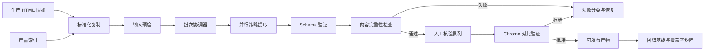

# AzureCNArchaeologist v0.1 → v1.0 路线图

> 文档状态：当前项目路线图  
> 当前版本：v0.1  
> 基线日期：2026-07-16  
> 适用范围：Azure 中国区产品 HTML 标准化、策略化解析、CMS JSON 导出与质量验证

## 1. 路线图目的

AzureCNArchaeologist 当前已经具备可运行的核心提取链路和 4 种解析策略，但还没有形成稳定、可信、可重复执行的生产工作流。

从 v0.1 到 v1.0 的核心目标不是继续堆叠功能，而是把现有能力收敛为一套：

- 可用一个入口完成完整批次处理；
- 每次运行均可追溯、可恢复、可比较；
- 解析结果经过机器验证和人工核验；
- 支持范围和准确性有明确证据；
- 不再依赖失效代码和漂移文档；
- 只有通过质量门槛的结果才能被发布。

本路线图是版本演进的事实基线。旧的阶段文档可以作为历史参考，但其中的“已完成”声明不能替代当前代码、测试和验收结果。

## 2. v0.1 当前基线

### 2.1 已具备的主流程

当前系统实际包含三个阶段：

```text
阶段 1：生产 HTML 快照
data/current_prod_html/{language}/pricing/details/...
data/current_prod_html/{language}/SupportArticles/{articleType}/...

阶段 2：标准化输入
products-index.json
  → scripts/auto_copy_html.py
  → data/prod-html/{language}/{category}/{product}.html
  → data/prod-html/{language}/SupportArticles/{articleType}/{product}.html

阶段 3：解析与导出
cli.py
  → ExtractionCoordinator
  → StrategyManager / PageAnalyzer
  → StrategyFactory
  → 具体策略
  → FlexibleContentPage 或 SupportArticlePage JSON
```

其中：

- `data/current_prod_html` 保存从生产环境取得的最新原始 HTML 快照；定价页位于 `pricing/details`，支持文章位于 `SupportArticles`；
- `scripts/auto_copy_html.py` 根据 `products-index.json` 查找、复制并重命名 HTML；
- `data/prod-html` 是解析管道使用的标准化输入；支持文章在每个语言下继续保留 `SupportArticles/{articleType}` 分类；
- 单产品和批处理最终复用 `ExtractionCoordinator`。

`SupportArticles/{articleType}` 是已确认的生产快照与标准化输入目录约定；当前复制脚本和产品索引尚未完整接入该模型，需在 v0.2 完成。

### 2.2 已实现的解析策略

| 策略 | 主要页面类型 | 当前代表产品 |
|---|---|---|
| `simple_static` | 无可见筛选器的静态定价页 | event-grid、service-bus |
| `region_filter` | 只有区域筛选的定价页 | api-management、azure-firewall |
| `complex` | 多筛选器、Tab 或复合映射页面 | cloud-services、virtual-machine-scale-sets |
| `support_article` | SLA、ICP、法律、公安备案文章 | icp-faq、sla-cognitive-services |

4 种策略的代表页面均能走通当前端到端提取链路。

### 2.3 v0.1 已知问题

当前项目仍属于内部 Alpha，主要问题包括：

1. 三段式流程存在多个分散命令，缺少一个批次级入口。
2. 批处理记录以单产品为主，缺少完整的批次清单和发布状态。
3. Flexible JSON 的当前输出与 CMS 契约说明存在字段和类型漂移，同时新旧验证规则混用，现有质量分数不可信。
4. 产品索引中的总数、产品列表、分类、配置路径存在不一致。
5. 现有测试大多是打印式诊断脚本，缺少有效断言和失败退出。
6. 尚未建立 Chrome 页面、原始快照和 JSON 预览之间的人工核验闭环。
7. `large_file` 会被策略管理器选择，但没有对应的已注册实现。
8. 部分 CLI 导出命令、参数和状态说明已经失效。
9. README 和部分 `docs/` 文档包含大量未实现或过期声明。
10. 缺少基于准确性证据定义的产品支持矩阵。

## 3. v1.0 目标架构



v1.0 中需要清晰区分：

- **Source snapshot**：未经修改的生产 HTML 快照；
- **Normalized input**：按照产品、语言和类别组织的解析输入；
- **Batch run**：一次具有唯一 ID、输入清单和代码版本的全流程运行；
- **Extracted output**：策略提取完成但尚未批准的结果；
- **Validated output**：通过机器验证的结果；
- **Approved output**：经过必要人工核验、允许发布的结果；
- **Published output**：已交付 CMS 或外部存储的正式产物。

## 4. 版本演进总览

| 版本 | 主题 | 核心结果 |
|---|---|---|
| v0.1 | 当前基线 | 4 种策略和分散的三段式流程可运行 |
| v0.2 | 事实与契约收口 | 产品全集、CMS 契约和状态边界统一 |
| v0.3 | 批次工作流 | 一个入口完成标准化、解析、验证和报告 |
| v0.4 | 自动化验证 | 建立可信测试、结构验证和内容完整性检查 |
| v0.5 | 人工核验闭环 | 建立 Chrome 对比验证和审核记录 |
| v0.6 | 覆盖率提升 | 按失败类型和页面结构簇扩大可靠支持范围 |
| v0.7 | 稳定性与性能 | 大文件、并发、恢复、幂等性达到批量运行要求 |
| v0.8 | 架构清理 | 删除 stale 代码，收缩 CLI、依赖和重复职责 |
| v0.9 | 发布候选 | 全量演练、缺陷收敛、文档重建和发布冻结 |
| v1.0 | 稳定版 | 可重复、可验证、可审核、可安全发布 |

版本号表示能力和质量门槛，不表示固定日历日期。后续版本只有在当前版本验收条件全部满足后才能升级。

## 5. 分版本路线图

### v0.2：建立可信事实基线

#### 目标

先解决“产品有多少、支持什么、输出应该长什么样、成功如何定义”等基础问题。

#### 主要工作

- 以逐产品配置作为产品全集的唯一事实来源，包括每个产品的 slug；`products-index.json` 改为可重复生成并校验漂移的派生索引，并携带从逐产品配置汇总的 slug。
- 修复 `products-index.json` 中的：
  - 重复产品；
  - 分类数量漂移；
  - 分类名称拼写错误；
  - 配置目录不一致；
  - 配置 `category` 与索引分类不一致；
  - URL、slug 和标准化文件路径不一致。
- 将 CMS 同事提供的两份文档登记为上游契约说明基线：
  - `docs/cms-json-new-schema/FlexibleContentPage-JSON-Schema-1.1.md`；
  - `docs/cms-json-new-schema/SupportArticlePage-JSON-schema.md`。
- 明确区分三类契约证据：
  - **CMS 契约说明**：上游提供的 Markdown 文档和示例；
  - **本地机器契约**：由说明文档和确认结论生成的可执行 JSON Schema；
  - **CMS 导入证据**：代表 payload 在 CMS 测试环境被成功接受的记录。
- 将已经与 CMS 确认的规则作为 v0.2 本地机器契约基线：
  - `leftNavigationIdentifier` 必填，值取自原始 HTML 的 `ms.service`；缺失或为空时验证失败；
  - `filtersJsonConfig` 是 JSON 字符串，内部使用 `filterDefinitions`；当前定义使用 `filterKey`、小写 `filterType`、`displayName` 和 `options`，选项使用 `value`、`label`、`href`；
  - `filterCriteriaJson` 是 JSON 字符串，内部值为筛选条件对象数组；每个条件的 `matchValues` 是字符串值；
  - `sectionTitle` 允许为空；
  - Flexible 业务 JSON 中未在契约说明里声明的字段（例如 `language`）由 CMS 忽略，不因这些字段存在而导入或验证失败；
  - SupportArticle 业务 JSON 的 `pageType` 只能输出大写 `SLA`、`LEGAL`、`ICP`、`PSR`；
  - SupportArticle slug 仍由逐产品配置维护，生成的 `products-index.json` 必须包含同值 slug。
- 建立 SupportArticle 类型、CMS `pageType` 和物理目录的固定映射：

  | 支持文章类型 | CMS `pageType` | `{articleType}` 目录 |
  |---|---|---|
  | SLA | `SLA` | `SLA` |
  | 法律 | `LEGAL` | `Legal` |
  | ICP 备案 | `ICP` | `ICP` |
  | 公安备案 | `PSR` | `PublicSecurityRegistration` |

- SupportArticle 生产快照和标准化输入均使用相同的中英文目录骨架：
  - `data/current_prod_html/{zh-cn|en-us}/SupportArticles/{articleType}/...`；
  - `data/prod-html/{zh-cn|en-us}/SupportArticles/{articleType}/{product}.html`。
- 扩展 `scripts/auto_copy_html.py` 及其配置输入，使 SupportArticle 能按逐产品配置中的文章类型和源路径，从对应语言的 `current_prod_html/SupportArticles` 复制到 `prod-html/SupportArticles`。
- `options.isDefault` 和 `order` 在 CMS 进一步确认前不进入 v0.2 业务契约；后续若增加，必须升级本地契约版本并补充导入回归。
- 生成并冻结两套 CMS 业务 JSON 的机器可执行 Schema；Flexible 使用已明确的 1.1 版本，SupportArticle 在 CMS 确认后建立本地契约版本并记录上游文档哈希。
- 明确业务 JSON 与运行诊断的边界：CMS 业务 payload 保持纯净，提取元数据、验证结果和错误信息进入独立 sidecar。
- 统一字段命名、契约版本和 sidecar 结构。
- 使用正交状态维度，避免将“提取成功但验证失败”压缩为一个含糊状态：
  - execution：`pending`、`running`、`succeeded`、`failed`、`skipped`；
  - validation：`not_run`、`passed`、`failed`；
  - review：`not_requested`、`pending`、`approved`、`rejected`；
  - publication：`not_published`、`published`。
- 生成当前产品 × 语言 × HTML × 策略的基线清单。

#### 交付物

- 可程序化验证的产品索引。
- 两套 CMS 业务 JSON 的机器可执行 Schema。
- 业务 JSON 与诊断 sidecar 的边界及 sidecar 结构定义。
- CMS 契约说明—本地 Schema—当前代码的字段一致性矩阵。
- 契约确认记录 `docs/cms-json-new-schema/CONTRACT-CONFIRMATIONS.md` 和 CMS 测试导入证据。
- 当前覆盖率基线报告。
- 统一的错误分类和运行状态定义。
- v0.1 代表产品的基准输出快照。

#### 验收标准

- 索引中产品总数等于唯一产品列表长度。
- 产品不存在跨分类重复。
- 每个索引产品都能定位到配置文件，或被明确标记为不支持。
- 配置、标准化路径、slug 和 URL 的差异均有明确规则。
- 所有产品 slug 均满足 CMS 契约，或存在经 CMS 确认并记录的兼容例外。
- 生成索引中每个产品的 slug 与对应逐产品配置一致，不存在第二个可独立修改的 slug 来源。
- Flexible 的 `leftNavigationIdentifier` 非空且来自 `ms.service`；`sectionTitle` 为空不被判定为契约错误。
- `filtersJsonConfig` 符合已确认的 `filterKey`/`filterType`/`displayName`/`options` 结构，v0.2 不擅自输出尚未确认的 `options.isDefault` 和 `order`。
- `filterCriteriaJson` 内部是条件对象数组，`matchValues` 按字符串验证，并能与同一 `filterKey` 下的选项值对应。
- Flexible 业务 JSON 中的 `language` 等未声明字段被容忍并忽略，不导致本地 Schema 验证或 CMS 导入失败。
- SupportArticle 仅输出 `SLA`、`LEGAL`、`ICP`、`PSR` 四个大写 `pageType`，并能按固定映射定位 zh-cn 和 en-us 的生产快照与标准化 HTML。
- `event-grid`、`api-management`、`cloud-services`、`icp-faq` 四个代表产品均通过本地机器契约和 CMS 测试导入。
- Flexible 业务 payload 可以保留 CMS 会忽略的未声明业务字段（例如 `language`）；项目仍不主动把 `validation`、`extraction_metadata`、错误和来源信息混入业务 payload，而是写入诊断 sidecar。
- `filtersJsonConfig` 和 `filterCriteriaJson` 的外层与内层结构均通过验证，筛选器定义、选项和内容组条件能够相互对应。
- Flexible 输出不再被旧版字段规则错误判定为无效。
- 4 种策略至少各有一个固定基准样例。

### v0.3：建立统一批次工作流

#### 目标

将当前分散的三个阶段串联成一个可观察、可恢复的批次。

#### 计划中的 CLI 能力

以下命令名称是目标接口，最终命名可在实现时调整：

```bash
uv run cli.py pipeline-run --all --language both
uv run cli.py pipeline-run --group database --language zh-cn
uv run cli.py pipeline-status --batch-id <batch-id>
uv run cli.py pipeline-resume --batch-id <batch-id>
uv run cli.py pipeline-validate --batch-id <batch-id>
```

#### 批次阶段

```text
snapshot discovery
→ normalize/copy
→ preflight
→ extract
→ validate
→ create review queue
→ report
```

#### 主要工作

- 引入批次级协调器，不复制现有提取业务逻辑。
- 复用：
  - `HTMLFileCopier`；
  - `ProductManager`；
  - `BatchProcessEngine`；
  - `ExtractionCoordinator`；
  - 现有 4 种策略。
- 为每次运行生成唯一 `batch_id`。
- 记录：
  - Git commit；
  - 产品索引哈希；
  - 输入文件哈希；
  - 语言和处理范围；
  - 使用策略；
  - 输出路径；
  - 错误和耗时；
  - 验证及审核状态。
- 支持失败隔离、断点续跑和幂等重跑。
- 未经批准的结果不得自动进入发布阶段。

#### 推荐批次目录

```text
runs/{batch_id}/
├── batch-manifest.json
├── input-manifest.json
├── outputs/
│   ├── zh-cn/{category}/{product}.json
│   ├── en-us/{category}/{product}.json
│   ├── zh-cn/SupportArticles/{articleType}/{product}.json
│   └── en-us/SupportArticles/{articleType}/{product}.json
├── validation/
├── review/
└── batch-report.json
```

#### 验收标准

- 一个命令可以完成标准化复制、批量提取、验证和报告。
- 同一批次可在失败后从中断阶段继续。
- 重跑不会产生无法区分的重复正式产物。
- 单个产品失败不会中断整个批次。
- 每个产物都能追溯到源 HTML、配置、代码版本和批次。
- 批次报告能够准确汇总成功、失败、跳过和待审核数量。

### v0.4：建立自动化质量验证

#### 目标

将“命令没有报错”升级为“结果满足结构和内容质量要求”。

#### 验证层次

##### 1. 配置与输入验证

- 产品配置完整性；
- 输入文件存在性；
- 文件编码和基本 HTML 可解析性；
- 源文件与标准化文件哈希或内容一致性；
- 语言、类别和产品路径一致性。

##### 2. Schema 验证

- 以 v0.2 冻结的 CMS 机器契约为唯一结构验证来源，不再在产品配置中重复维护旧字段规则；
- 必填字段、已声明字段类型、枚举及页面类型条件正确；Flexible 根对象的未声明字段采用容忍并忽略的策略；
- `filterCriteriaJson`、`filtersJsonConfig` 不仅是合法 JSON，其内部对象也符合 CMS 契约，其中 `matchValues` 按字符串验证；
- `contentGroups` 与筛选器定义、选项、默认值和条件组合可对应；
- SupportArticle 与 FlexibleContent 使用各自独立规则。

##### 3. 内容完整性验证

- 标题、Meta、Banner、Description 是否存在；
- 原始 HTML 与输出中的表格数量；
- FAQ 问题数量；
- 区域选项与区域内容组数量；
- Tab、软件和区域组合覆盖情况；
- 归一化文本覆盖率；
- 空内容、重复内容和跨区域内容泄漏；
- 结果相对已批准基线的变化。

##### 4. 回归测试

- 使用 `pytest` 建立有效断言。
- 测试缺失样例时必须失败或明确跳过，不能输出“通过”。
- 为每种策略建立：
  - 单元测试；
  - 组件测试；
  - 端到端 golden-file 测试。

#### 验收标准

- 测试命令的退出码真实反映成功或失败。
- 4 种策略都有自动化端到端测试。
- 每个 JSON 产物都有独立验证报告。
- 质量分数来自 v0.2 冻结的本地机器契约和当前内容指标，不再引用旧版字段。
- 解析失败、验证失败和人工拒绝是三种不同状态。
- CI 能阻止 Schema 回归和代表产品输出回归。

### v0.5：建立 Chrome 人工核验闭环

#### 目标

为自动化无法证明的语义正确性建立可重复的人工审核方式。

#### 对比对象

建议采用三方主对比、线上页面辅助参考：

1. `data/current_prod_html` 中的原始生产快照；
2. `data/prod-html` 中的标准化输入；
3. JSON 渲染后的本地预览；
4. 当前生产 URL，作为可能已经发生变化的辅助参考。

#### 策略核验清单

##### SimpleStatic

- 正文是否完整；
- FAQ、SLA 是否遗漏或重复；
- Banner 和产品描述是否正确；
- 页面主体是否混入导航或 UI 元素。

##### RegionFilter

- 区域选项数量是否一致；
- 每个区域的表格和价格是否正确；
- 是否存在跨区域内容污染；
- 默认区域和筛选器配置是否正确。

##### Complex

- 筛选器和 Tab 组合是否完整；
- 内容映射是否对应正确组合；
- 共享内容是否重复或丢失；
- 是否出现组合缺失、错误合并或空内容。

##### SupportArticle

- 标题、slug、日期和 Meta 是否正确；
- `pageType` 是否为 `SLA`、`LEGAL`、`ICP`、`PSR` 之一，并与 `SupportArticles/{articleType}` 目录映射一致；
- `articleDescription` 边界是否正确；
- `mainContent` 是否完整；
- 是否移除反馈组件、选择器和其他 UI 元素。

#### 审核记录

每次人工审核至少保存：

- `batch_id`；
- 产品和语言；
- 输入及输出哈希；
- 审核结果：`approved`、`rejected`、`needs_review`；
- 问题分类；
- 审核时间；
- 审核人；
- 备注；
- 是否可作为新的 golden baseline。

#### 验收标准

- 能从批次报告直接定位待审核产品。
- 审核人员可以在 Chrome 中快速完成对比。
- 4 种策略均有至少一组人工批准的代表产品。
- 人工拒绝结果不能被发布。
- 已批准结果可以成为后续批次的回归基线。

### v0.6：提高产品解析覆盖率

#### 目标

从“少数代表产品可运行”提升为“支持范围明确且大部分产品可靠解析”。

#### 覆盖率定义

项目不再只报告一个含糊的“支持产品数”，而应分别报告：

| 指标 | 定义 |
|---|---|
| 配置覆盖率 | 产品具有合法、可加载配置 |
| 输入覆盖率 | 对应语言的标准化 HTML 存在 |
| 路由覆盖率 | 页面能够选择明确且已实现的策略 |
| 提取覆盖率 | 能够生成目标 JSON |
| 验证通过率 | 通过 Schema 和内容完整性检查 |
| 人工批准率 | 已经人工核验并批准 |
| 发布覆盖率 | 当前批次中允许正式发布 |

#### 失败分类

```text
配置错误
复制映射错误
输入缺失
编码或 HTML 解析错误
策略误判
通用内容定位失败
区域内容映射失败
复杂筛选组合失败
Schema 验证失败
内容质量失败
人工审核失败
```

#### 提升原则

- 优先按页面结构簇修复，不按产品逐个堆叠硬编码。
- 产品专用配置只能处理真实业务差异，不能掩盖通用解析缺陷。
- 新增支持产品前必须补充自动化样例。
- “支持产品”必须表示通过当前质量门槛，而不是仅存在于索引中。

#### 验收标准

- 所有已声明支持的产品均能加载配置并定位输入。
- 每类失败都有明确错误代码和诊断信息。
- 每次批次自动生成产品 × 语言 × 策略的覆盖率矩阵。
- 对计划纳入 v1.0 的产品集合：
  - 提取成功率不低于 95%；
  - 机器验证通过率不低于 90%；
  - 所有页面结构簇均有人工批准样例。
- 未达到质量门槛的产品被明确标为 experimental 或 unsupported。

上述百分比是最低质量门槛；如果后续基线表明目标过低，应提高而不是降低。

### v0.7：稳定性、性能与大文件处理

#### 目标

使完整批次可以稳定处理当前产品规模，并且不会通过静默降级隐藏错误。

#### 主要工作

- 正式实现 `large_file` 策略，或在未实现前禁止策略管理器选择它。
- 移除“大文件自动回退 SimpleStatic”的静默行为。
- 避免策略分析和正式提取重复读取、重复解析同一 HTML。
- 复用批次级 `ProductManager`、配置缓存和解析上下文。
- 对并发线程数、内存峰值和批次耗时建立基线。
- 实现真实、可观测的重试策略：
  - 仅重试可恢复错误；
  - 记录重试原因和次数；
  - 不通过重试掩盖确定性解析错误。
- 处理进程中断、残留 `running` 状态和损坏产物。
- 为超大 HTML 建立专门的性能和正确性测试。

#### 验收标准

- 超过大文件阈值时不会静默使用错误策略。
- 完整批次的资源使用有可重复基线。
- 相同输入和代码版本产生确定性等价输出。
- 中断后的批次可以恢复，不会丢失已完成结果。
- 并发处理不破坏 SQLite 记录、日志或输出文件。
- 性能优化不得降低 golden baseline 的准确性。

### v0.8：架构清理与 stale 代码治理

#### 目标

在测试保护下删除过期、重复、不可达或契约失效的代码。

#### 代码分类

所有候选代码先被分类为：

- `active`：当前主链使用；
- `compatibility`：有明确使用方的兼容层；
- `experimental`：未完成且不属于稳定主链；
- `dead`：不可达、重复或契约已经失效。

#### 优先审查对象

- 未实现的传统 `batch_command`；
- CLI 无法正确调用的 HTML/RAG 导出路径；
- 新旧两套验证逻辑；
- 未实现但可被选中的 `large_file` 路径；
- `ProductManager` 中重复方法；
- 各模块自行修改 `sys.path` 的逻辑；
- 未使用参数和兼容字段；
- 只存在于注释、README 或目录占位中的 RAG 功能；
- 与实际输出不一致的数据模型、导出器和状态说明；
- 大量产品硬编码与已经无效的特殊映射。

#### 清理原则

- 先建立测试，再删除代码。
- 不以“长时间未修改”作为唯一删除理由。
- 每次清理保持范围小、可回滚。
- 删除兼容层前必须确认调用方。
- 不保留会让使用者误以为功能已经实现的空入口。

#### 验收标准

- CLI 中每个公开命令都可运行并有测试，或被删除。
- 主提取链只有一套输出构建和验证路径。
- 项目导入不再依赖模块内的 `sys.path` 修改。
- 未实现功能不会以“已支持”的形式出现在 CLI 或文档中。
- 删除 stale 代码后，全批次回归结果不退化。

### v0.9：发布候选与文档重建

#### 目标

冻结 v1.0 范围，完成全量演练、缺陷收敛和文档重建。

#### 文档结构

根目录 `README.md` 仅描述当前可用能力和快速开始。详细内容拆分为：

```text
README.md
ROADMAP.md
docs/
├── architecture.md
├── batch-workflow.md
├── validation.md
├── manual-review.md
├── product-coverage.md
├── configuration.md
└── release-process.md
```

其中 `product-coverage.md` 应尽量由批次数据自动生成。

#### README 重建要求

- 删除未实现的混合 RAG、计算器、知识图谱和 Web 服务声明。
- 每一条“已实现”能力必须对应：
  - 可运行命令；
  - 自动化测试；
  - 或可检查的产物。
- 清晰说明：
  - 数据来源；
  - 三段式主流程；
  - 4 种策略；
  - 输出格式；
  - 当前限制；
  - 人工审核与发布流程。
- 未来需求统一放在本路线图或单独 roadmap 文档中。

#### 发布候选演练

- 使用一批新的生产 HTML 快照执行完整流程。
- 同时验证中文和英文处理。
- 完成失败恢复和重复运行测试。
- 完成机器验证和抽样人工审核。
- 生成候选发布报告。
- 冻结 CMS 上游契约说明的版本/文件哈希、本地机器契约版本、成功导入证据、CLI 和配置格式。

#### 验收标准

- README 与实际代码、命令和目录一致。
- 无已知 P0/P1 缺陷。
- v1.0 范围内所有命令具有使用文档和测试。
- 全量候选批次满足既定质量门槛。
- 发布、回滚和重新生成流程均经过演练。

### v1.0：稳定、可信的生产版本

#### v1.0 定义

v1.0 不表示所有 Azure 页面都已经被完美解析，而表示项目对“已声明支持”的范围提供了可信承诺：

- 可以从最新生产 HTML 快照开始执行完整批次；
- 批次结果可追溯、可恢复、可重复；
- 4 种策略都有自动化与人工验证证据；
- 支持矩阵准确反映产品和语言覆盖情况；
- 解析和验证失败不会被伪装成成功；
- 未批准的结果不能发布；
- 文档与实际实现一致。

#### v1.0 发布门槛

##### 数据与配置

- 产品索引零重复、零失效配置路径。
- 索引统计全部由实际产品列表生成。
- 输入标准化过程可审计并具有清单。

##### 工作流

- 一个入口完成标准化、解析、验证和报告。
- 批次支持状态查询、失败恢复和幂等重跑。
- 每个输出可追溯到源文件、配置和代码版本。

##### 策略与准确性

- 4 种策略都有：
  - 单元测试；
  - 端到端测试；
  - 人工批准样例；
  - 明确的适用范围和已知限制。
- v1.0 支持集合达到 v0.6 定义的覆盖率门槛。
- 高风险或发生显著变化的结果进入人工审核。

##### 可靠性

- 无静默策略降级。
- 无已知数据破坏或跨产品内容污染问题。
- 大文件和并发处理具有明确行为。
- 所有 P0/P1 缺陷关闭。

##### 发布

- 只有 `approved` 结果能够进入正式发布目录或 Blob Storage。
- 发布清单包含批次、产品、语言、文件哈希、本地契约版本和对应的 CMS 上游契约说明哈希。
- 发布失败可回滚，历史批次可重现。

##### 文档

- README 只陈述当前真实能力。
- 架构、工作流、验证、审核、覆盖率和发布过程均有独立文档。
- 路线图中未完成能力不会出现在“已实现”列表中。

## 6. v1.0 明确不包含的范围

除非后续重新评估并修改路线图，以下能力不属于 v1.0 必须项：

- 混合 RAG 检索系统；
- Embedding、Rerank 和向量数据库；
- Azure 产品知识图谱；
- 定价计算器逻辑重建；
- 在线 AI 助手或 API 服务；
- Streamlit 或其他 Web 管理界面；
- 实时抓取生产网站；
- 使用 AI 完全替代人工准确性审核；
- 自动向生产 CMS 发布而没有批准门槛。

这些能力只能在核心解析平台达到 v1.0 后，以独立项目或 v1.x/v2.0 路线评估。

## 7. 横向工程要求

以下要求贯穿所有版本：

### 可观察性

- 使用结构化日志和稳定错误代码。
- 日志必须包含 `batch_id`、产品、语言、阶段和策略。
- 批次报告能区分系统错误、配置错误、解析错误和质量失败。

### 可重复性

- 同一源文件、配置和代码版本应产生确定性等价结果。
- 时间戳等非业务字段不能阻碍结果差异比较。

### 安全性

- 连接字符串和凭证不写入仓库、日志或批次清单。
- 上传必须是显式阶段，并支持 dry-run。
- 人工审核和发布权限应分离。

### 可维护性

- 优先修复页面结构模式，不堆叠产品专用分支。
- CMS 上游契约说明、本地机器契约、产品配置和状态枚举均应有明确且唯一的事实来源。
- 代码、测试和文档必须在同一变更中保持同步。

## 8. 推荐实施顺序

路线图的关键依赖关系是：

```text
事实基线
→ CMS 契约说明确认
→ 本地机器契约
→ 批次工作流
→ 自动化验证
→ 人工核验
→ 覆盖率提升
→ 性能与稳定性
→ stale 代码清理
→ 文档重建
→ v1.0 发布
```

不建议提前进行大规模代码清理或性能重写，因为在可信测试和基准产物建立之前，无法证明清理没有破坏解析准确性。

同样，不建议先实现自动发布。项目首先需要证明结果正确，然后才能提高执行速度和发布自动化程度。

## 9. 版本决策与变更规则

- 每个版本开始前，将工作拆分为可独立验收的 issue 或任务。
- 每个版本结束时生成一次基线报告并记录已知限制。
- 新发现的严重数据准确性问题优先于功能开发。
- 如果某个目标无法在当前版本安全完成，应显式延后，不能通过静默回退宣布完成。
- 修改 v1.0 范围时，应同步更新本路线图、验收标准和 README。

---

最终目标不是“运行成功”，而是：

> 从最新生产 HTML 出发，一个命令能够生成可追溯批次；每个结果都有机器验证和必要的人工审核；失败可以定位和恢复；只有批准结果能够发布；项目对外声明的支持范围与真实准确性一致。
