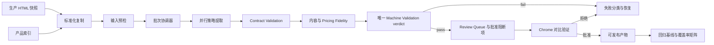

# AzureCNArchaeologist v0.1 → v1.0 路线图

> 文档状态：当前项目路线图  
> 当前版本：v0.3
> 基线日期：2026-07-21
> 适用范围：Azure 中国区产品 HTML 标准化、策略化解析、CMS JSON 导出与质量验证

## 1. 路线图目的

AzureCNArchaeologist 已在 v0.3 形成并通过全量验收的统一、可追溯、可恢复批次工作流。后续版本仍需补齐深度内容质量验证、人工核验与发布门禁，才能达到稳定生产版本目标。

从 v0.1 到 v1.0 的核心目标不是继续堆叠功能，而是把现有能力收敛为一套：

- 可用一个入口完成完整批次处理；
- 每次运行均可追溯、可恢复、可比较；
- 解析结果经过机器验证和人工核验；
- 支持范围和准确性有明确证据；
- 不再依赖失效代码和漂移文档；
- 只有通过质量门槛的结果才能被发布。

本路线图是版本演进的事实基线。旧的阶段文档可以作为历史参考，但其中的“已完成”声明不能替代当前代码、测试和验收结果。

## 2. v0.1 当前基线

### 2.1 已具备的主流程

当前系统实际包含三个阶段：

```text
阶段 1：生产 HTML 快照
data/current_prod_html/{language}/pricing/details/...
data/current_prod_html/{language}/SupportArticles/{articleType}/...

阶段 2：标准化输入
products-index.json
  → scripts/auto_copy_html.py
  → data/prod-html/{language}/pricing/{product_key}.html
  → data/prod-html/{language}/SupportArticles/{type-dir}/{product_key}.html

阶段 3：解析与导出
cli.py
  → ExtractionCoordinator
  → StrategyManager / PageAnalyzer
  → StrategyFactory
  → 具体策略
  → FlexibleContentPage 或 SupportArticlePage JSON
```

其中：

- `data/current_prod_html` 保存从生产环境取得的最新原始 HTML 快照；定价页位于 `pricing/details`，支持文章位于 `SupportArticles`；
- `scripts/auto_copy_html.py` 根据 Product Definition 中逐语言声明的精确 Source Location 复制并校验 HTML；
- `data/prod-html` 是解析管道使用的标准化输入；支持文章在每个语言下继续保留 `SupportArticles/{articleType}` 分类；
- 单产品和批处理最终复用 `ExtractionCoordinator`。

`SupportArticles/{articleType}` 是标准化输入和产物的 canonical 目录约定；生产快照的原始目录不用于推导 Support Article Type。

### 2.2 已实现的解析策略

| 策略 | 主要页面类型 | 当前代表产品 |
|---|---|---|
| `simple_static` | 无可见筛选器的静态定价页 | event-grid、service-bus |
| `region_filter` | 只有区域筛选的定价页 | api-management、azure-firewall |
| `complex` | 多筛选器、Tab 或复合映射页面 | cloud-services、virtual-machine-scale-sets |
| `support_article` | SLA、ICP、法律、公安备案文章 | icp-faq、sla-cognitive-services |

4 种策略的代表页面均能走通当前端到端提取链路。

### 2.3 v0.1 已知问题

当前项目仍属于内部 Alpha，主要问题包括：

1. 三段式流程存在多个分散命令，缺少一个批次级入口。
2. 批处理记录以单产品为主，缺少完整的批次清单和发布状态。
3. Flexible JSON 的当前输出与 CMS 契约说明存在字段和类型漂移，同时新旧验证规则混用，现有质量分数不可信。
4. 产品索引中的总数、产品列表、分类、配置路径存在不一致。
5. 现有测试大多是打印式诊断脚本，缺少有效断言和失败退出。
6. 尚未建立 Chrome 页面、原始快照和 JSON 预览之间的人工核验闭环。
7. `large_file` 会被策略管理器选择，但没有对应的已注册实现。
8. 部分 CLI 导出命令、参数和状态说明已经失效。
9. README 和部分 `docs/` 文档包含大量未实现或过期声明。
10. 缺少基于准确性证据定义的产品支持矩阵。

## 3. v1.0 目标架构


```mermaid
flowchart LR
    A[生产 HTML 快照] --> B[标准化复制]
    I[产品索引] --> B
    B --> C[输入预检]
    C --> D[批次协调器]
    D --> E[并行策略提取]
    E --> F[Contract Validation]
    F --> G[内容与 Pricing Fidelity]
    G --> M[唯一 Machine Validation verdict]
    M -->|fail| X[失败分类与恢复]
    M -->|pass| H[Review Queue 与批准阻断项]
    H --> J[Chrome 对比验证]
    J -->|拒绝| X
    J -->|批准| K[可发布产物]
    K --> L[回归基线与覆盖率矩阵]
```

v1.0 中需要清晰区分：

- **Source snapshot**：未经修改的生产 HTML 快照；
- **Normalized input**：按照语言、内容类型、Resource Key 和可选版本身份组织的字节级一致解析输入；Catalog Category 仅为元数据视图；
- **Batch run**：一次具有唯一 ID、输入清单和代码版本的全流程运行；
- **Extracted output**：策略提取完成但尚未批准的结果；
- **Validated output**：通过机器验证的结果；
- **Approved output**：经过必要人工核验、允许发布的结果；
- **Published output**：已交付 CMS 或外部存储的正式产物。

## 4. 版本演进总览

| 版本 | 主题 | 核心结果 |
|---|---|---|
| v0.1 | 当前基线 | 4 种策略和分散的三段式流程可运行 |
| v0.2 | 事实与契约收口 | 产品全集、CMS 契约和状态边界统一 |
| v0.3 | 批次工作流 | 一个入口完成标准化、解析、验证和报告 |
| v0.4 | 可证明重建验证 | P0 隔离实验导出、Pricing Fidelity、批准阻断项和 CI-ready 可信测试体系 |
| v0.5 | 通用人工核验闭环 | 将 v0.4 的复杂表格专项门禁扩展到全部页面类型 |
| v0.6 | 覆盖率提升 | 按失败类型和页面结构簇扩大可靠支持范围 |
| v0.7 | 稳定性与性能 | 正交 streaming Processing Mode、并发、恢复和幂等性达到批量运行要求 |
| v0.8 | 架构清理 | 删除 stale 代码，收缩 CLI、依赖和重复职责 |
| v0.9 | 发布候选 | 全量演练、缺陷收敛、文档重建和发布冻结 |
| v1.0 | 稳定版 | 可重复、可验证、可审核、可安全发布 |

版本号表示能力和质量门槛，不表示固定日历日期。后续版本只有在当前版本验收条件全部满足后才能升级。

## 5. 分版本路线图

### v0.2：建立可信事实基线

> 状态：已完成（2026-07-21）。自动化门槛、双语快照闭环、代表 payload CMS 测试导入、内容核验及 SLA 历史版本路由验证均已通过；证据见 `reports/v0.2/acceptance-status.md`。

#### 目标

先解决“产品有多少、支持什么、输出应该长什么样、成功如何定义”等基础问题。

#### 主要工作

- 以 Product Definition 1.0 作为产品全集的唯一事实来源，包括 Product Key、slug、能力状态、多分类成员关系、逐语言 Source Location，以及不增加产品计数的可发布 SLA 历史版本资源；`products-index.json` 是可重复生成并校验漂移的 Product Index 3.0。
- 修复 `products-index.json` 中的：
  - 重复产品；
  - 分类数量漂移；
  - 分类名称拼写错误；
  - 配置目录不一致；
  - 单值 category 与跨分类重复定义；
  - URL、slug 和标准化文件路径不一致。
- 将 CMS 同事提供的两份文档登记为上游契约说明基线：
  - `docs/cms-json-new-schema/FlexibleContentPage-JSON-Schema-1.1.md`；
  - `docs/cms-json-new-schema/SupportArticlePage-JSON-schema.md`。
- 明确区分三类契约证据：
  - **CMS 契约说明**：上游提供的 Markdown 文档和示例；
  - **本地机器契约**：由说明文档和确认结论生成的可执行 JSON Schema；
  - **CMS 导入证据**：代表 payload 在 CMS 测试环境被成功接受的记录。
- 将已经与 CMS 确认的规则作为 v0.2 本地机器契约基线：
  - `leftNavigationIdentifier` 必填，值取自原始 HTML 的 `ms.service`；缺失或为空时验证失败；
  - `filtersJsonConfig` 是 JSON 字符串，内部使用 `filterDefinitions`；当前定义使用 `filterKey`、小写 `filterType`、`displayName` 和 `options`，选项使用 `value`、`label`、`href`；
  - `filterCriteriaJson` 是 JSON 字符串，内部值为筛选条件对象数组；每个条件的 `matchValues` 是字符串值；
  - `sectionTitle` 允许为空；
  - Flexible 业务 JSON 中未在契约说明里声明的字段（例如 `language`）由 CMS 忽略，不因这些字段存在而导入或验证失败；
  - SupportArticle 业务 JSON 的 `pageType` 只能输出大写 `SLA`、`LEGAL`、`ICP`、`PSR`；
  - SupportArticle slug 仍由逐产品配置维护，生成的 `products-index.json` 必须包含同值 slug。
- 建立 SupportArticle 类型、CMS `pageType` 和 canonical 标准化/产物目录的固定映射；该映射不约束生产 Source Snapshot 的原始目录：

  | 支持文章类型 | CMS `pageType` | `{articleType}` 目录 |
  |---|---|---|
  | SLA | `SLA` | `SLA` |
  | 法律 | `LEGAL` | `Legal` |
  | ICP 备案 | `ICP` | `ICP` |
  | 公安备案 | `PSR` | `PublicSecurityRegistration` |

- Source Snapshot 由 Product Definition 的 `sources.zh-cn/en-us.snapshot_path` 精确定位，标准化输入使用 `data/prod-html/{lang}/SupportArticles/{articleType}/{product_key}.html`。
- `scripts/auto_copy_html.py` 不再包含特殊映射、目录猜测或首个 HTML 回退；复制后 source/normalized SHA-256 必须一致。
- `options.isDefault` 和 `order` 在 CMS 进一步确认前不进入 v0.2 业务契约；后续若增加，必须升级本地契约版本并补充导入回归。
- 生成并冻结两套 CMS 业务 JSON 的机器可执行 Schema；Flexible 使用已明确的 1.1 版本，SupportArticle 在 CMS 确认后建立本地契约版本并记录上游文档哈希。
- 明确业务 JSON 与运行诊断的边界：CMS 业务 payload 保持纯净，提取元数据、验证结果和错误信息进入独立 sidecar。
- 统一字段命名、契约版本和 sidecar 结构。
- 使用正交状态维度，避免将“提取成功但验证失败”压缩为一个含糊状态：
  - execution：`pending`、`running`、`succeeded`、`failed`、`skipped`；
  - validation：`not_run`、`passed`、`failed`；
  - review：`not_requested`、`pending`、`approved`、`rejected`；
  - publication：`not_published`、`published`。
- 生成当前产品 × 语言 × HTML × 策略的基线清单。

#### 交付物

- 可程序化验证的产品索引。
- 两套 CMS 业务 JSON 的机器可执行 Schema。
- 业务 JSON 与诊断 sidecar 的边界及 sidecar 结构定义。
- CMS 契约说明—本地 Schema—当前代码的字段一致性矩阵。
- 契约确认记录 `docs/cms-json-new-schema/CONTRACT-CONFIRMATIONS.md` 和 CMS 测试导入证据。
- 当前覆盖率基线报告。
- 统一的错误分类和运行状态定义。
- v0.1 代表产品的基准输出快照。

#### 验收标准

- 索引中产品总数等于唯一产品列表长度。
- Product Key 全局唯一；同一 Product Definition 可以出现在多个 catalog category 视图中，分类成员数之和允许大于唯一产品总数。
- 每个索引产品都能定位到配置文件，或被明确标记为不支持。
- 配置、标准化路径、slug 和 URL 的差异均有明确规则。
- 所有产品 slug 均满足 CMS 契约，或存在经 CMS 确认并记录的兼容例外。
- 生成索引中每个产品的 slug 与对应逐产品配置一致，不存在第二个可独立修改的 slug 来源。
- Flexible 的 `leftNavigationIdentifier` 非空且来自 `ms.service`；`sectionTitle` 为空不被判定为契约错误。
- `filtersJsonConfig` 符合已确认的 `filterKey`/`filterType`/`displayName`/`options` 结构，v0.2 不擅自输出尚未确认的 `options.isDefault` 和 `order`。
- `filterCriteriaJson` 内部是条件对象数组，`matchValues` 按字符串验证，并能与同一 `filterKey` 下的选项值对应。
- Flexible 业务 JSON 中的 `language` 等未声明字段被容忍并忽略，不导致本地 Schema 验证或 CMS 导入失败。
- SupportArticle 仅输出 `SLA`、`LEGAL`、`ICP`、`PSR` 四个大写 `pageType`；类型来自 Product Definition，而 Source Snapshot 和标准化 HTML 分别按显式 Source Location 与 canonical type directory 定位。
- `service-bus`、`dns`、`api-management`、`cloud-services`、`icp-faq` 五个代表产品均通过本地机器契约和 CMS 测试导入；Event Grid 在生产源页面修复前明确排除。
- Flexible 业务 payload 可以保留 CMS 会忽略的未声明业务字段（例如 `language`）；项目仍不主动把 `validation`、`extraction_metadata`、错误和来源信息混入业务 payload，而是写入诊断 sidecar。
- `filtersJsonConfig` 和 `filterCriteriaJson` 的外层与内层结构均通过验证，筛选器定义、选项和内容组条件能够相互对应。
- Flexible 输出不再被旧版字段规则错误判定为无效。
- 4 种策略至少各有一个固定基准样例。

### v0.3：建立统一批次工作流

> 状态：已完成。v0.3 全量双语验收于 2026-07-21 通过，项目版本已升级为 v0.3.0。

#### 目标

将当前分散的三个阶段串联成一个可观察、可恢复的批次。

#### 正式 CLI 接口

```bash
uv run cli.py pipeline-run --all --language both
uv run cli.py pipeline-run --group database --language zh-cn
uv run cli.py pipeline-status --batch-id <batch-id>
uv run cli.py pipeline-resume --batch-id <batch-id>
uv run cli.py pipeline-validate --batch-id <batch-id>
```

#### 批次阶段

```text
snapshot discovery
→ normalize/copy
→ preflight
→ extract
→ validate
→ create review queue
→ report
```

#### 主要工作

- 引入批次级协调器，不复制现有提取业务逻辑。
- 复用：
  - `HTMLFileCopier`；
  - `ProductManager`；
  - `BatchProcessEngine`；
  - `ExtractionCoordinator`；
  - 现有 4 种策略。
- 为每次运行生成唯一 `batch_id`。
- 记录：
  - Git commit；
  - 产品索引哈希；
  - 输入文件哈希；
  - 语言和处理范围；
  - 使用策略；
  - 输出路径；
  - 错误和耗时；
  - 验证及审核状态。
- 支持失败隔离、断点续跑和幂等重跑。
- 未经批准的结果不得自动进入发布阶段。

#### 固定批次目录

```text
runs/{batch_id}/
├── batch-manifest.json
├── input-manifest.json
├── outputs/{language}/pricing/{resource}.json
├── outputs/{language}/SupportArticles/{articleType}/{resource}.json
├── diagnostics/{language}/pricing/{resource}.sidecar.json
├── diagnostics/{language}/SupportArticles/{articleType}/{resource}.sidecar.json
├── validation/{language}/pricing/{resource}.validation.json
├── validation/{language}/SupportArticles/{articleType}/{resource}.validation.json
├── review/review-queue.json
├── logs/pipeline.jsonl
└── batch-report.json
```

Pricing 始终写入 `{language}/pricing`；同一 Product Definition 即使属于多个 catalog category 也只生成一份产物，category 仅作为元数据。`batch-manifest.json` 是唯一可变状态真源，validation、review queue、sidecar 和 report 均为可重建投影。

#### 验收标准

- 一个命令可以完成标准化复制、批量提取、验证和报告。
- 同一批次可在失败后从中断阶段继续。
- 重跑不会产生无法区分的重复正式产物。
- 单个产品失败不会中断整个批次。
- 每个产物都能追溯到源 HTML、配置、代码版本和批次。
- 批次报告能够准确汇总成功、失败、跳过和待审核数量。

#### 验收结果

- 全量双语批次共规划 434 项：379 项可运行且全部完成抽取与验证，54 项按 `known_unsupported` 跳过，1 项按历史源不可用跳过。
- 批次退出码为 `0`，七个阶段全部成功，379 项进入 review queue，434 项 publication 均保持 `not_published`。
- 无操作恢复保持 manifest、review queue、report 和 JSONL 日志逐字节不变；独立复核确认所有可运行项的 normalized input、payload、sidecar 和 validation 哈希一致。
- 42 个 `unittest` 回归测试全部通过，包含既有 17 个 v0.2 基线测试和 25 个 v0.3 测试。
- 完整证据见 [`reports/v0.3/acceptance-status.md`](reports/v0.3/acceptance-status.md) 和机器可读摘要 [`reports/v0.3/full-run-summary.json`](reports/v0.3/full-run-summary.json)。

### v0.4：建立可证明的内容重建验证与 CI-ready 测试体系

> 状态：产品与验证边界已完成决策冻结，待实施。

#### 目标与保证边界

将 `validation=passed` 从“成功生成且结构合法”升级为：

> 在冻结的 Source Snapshot、Validation Profile 和可采信行为证据下，能够证明 Business Payload 满足由 CMS Contract Description 派生的 Local Machine Contract，并忠实重建所有应发布内容及可达筛选状态中的 Pricing Facts。

v0.4 保证 **Pricing Fact Fidelity**，即忠实重建冻结页面中的定价事实及其筛选归属；它不保证外部 **Commercial Price Accuracy**。只有源证据明确声明稳定标识时才称为 SKU，不能把表格行或推断组合擅自命名为 SKU。

Frozen Source Snapshot 是批次内容权威。当前 live 页面只允许通过受控浏览器采集 non-authoritative Rendered Interaction Evidence；不采集 raw HTTP，不作为冻结批次的内容 Oracle，也不能自动改写 Source Snapshot、Expected Pricing Fact Inventory 或 Golden。

v0.4 不包含 GitHub Actions、required branch checks 或其他 external merge gate，不自动发布，不提供移动端视觉保证，也不要求在阶段结束前完成人工审核全部产品。它交付 runner-agnostic、可被未来自动化平台调用的 CI-ready 测试和报告能力。

#### 实施顺序

##### P0：隔离导出 `virtual-machines` 实验产物

这是 v0.4 的最高优先级实施切片，但不属于正式支持资格提升：

- 新增独立 `experimental-extract` 命令，不向正式 `extract` 或 pipeline 增加通用 `--skip-validation`；
- 使用 closed-world `data/configs/experimental-extraction-exceptions.json` 精确允许 canonical Product Key `virtual-machines`，绑定 Product Definition-resolved source path、语言、强制 `complex` 策略、逐语言字节数与 SHA-256、原因、责任团队、资源上限、输出根和到期条件；
- 输入直接读取 `data/current_prod_html/{language}/pricing/details/virtual-machines/index.html`，不复制到 canonical `data/prod-html`，也不允许任意 `--input-file`；固定 `zh-cn` 为 7,952,161 bytes / SHA-256 `c2dcc7f54cd78fbaa3052934e1b174b234d594431a7f0ea56ce7eb6b48749bfe`，`en-us` 为 7,120,359 bytes / SHA-256 `9cc3063549a3a44430bde949a816f16dd398291a859248c7513381ad69ed418c`；
- 实验上限固定为 8 MiB input、900 seconds wall time 和 2 GiB peak RSS，输出根固定为已被 Git 忽略的 `output/experiments/{experiment_id}/{language}/`；任何调整都必须经过 Specification review；
- Specification 在任一源哈希变化或 v0.4 完成时到期，以较早者为准；任何产品、语言、策略、哈希或大小不匹配都在提取前失败；
- `zh-cn` 优先满足当前离线研究请求；P0 只有在 `zh-cn` 与 `en-us` 都独立生成 Experimental Payload Candidate 与成功 Manifest 后才完成，任一语言资源或提取失败都使 P0 保持 blocked/failed，但不妨碍并行推进无依赖的 v0.4 基础工作；
- 仅执行输入存在性、严格 UTF-8、SHA-256、资源限制、解析执行和 JSON 原子写入等 execution-safety checks，不执行 CMS Contract、Pricing Fidelity 或内容质量验证；
- 在隔离进程中执行并记录资源数据，输出到 gitignored 实验目录；成功必须完整生成 `{resource}.unvalidated.json` 和 `experiment-manifest.json`，失败时删除临时或部分 Candidate，只向内部执行日志写诊断，不生成失败形态的交付 JSON；
- Manifest 固定标记 `trust_status=unvalidated`、`approval_eligible=false`、`publishable=false`，并记录强制策略、源哈希、原因和时间；
- 实验产物不得进入 canonical Batch outputs、Review Queue、Golden、事实基线、正式 upload 或 publication；Product Definition 继续保持 `known_unsupported`；
- 命令返回 `0` 只表示实验 JSON 与 Manifest 已生成，输出文案必须为 `EXPERIMENTAL OUTPUT GENERATED — UNVALIDATED` 而不是 `PASS`；策略、输入、资源或执行失败返回 `1`。

##### P1：配置、输入与运行能力边界

- Product Definition 使用版本化 closed-world 机器契约；未知、拼写错误或废弃字段先作为校准 finding，必须在 v0.4 结束前显式晋升为阻断；
- Product Key、Resource Key、页面模型、语言、Source Location 和 canonical 路径必须一致；Catalog Category 只作为元数据视图，不参与源或产物路径推导；
- Normalized Input 必须与 Source Snapshot 字节级一致并校验 SHA-256，不转码、不换行归一化、不修复 HTML；
- 仅接受严格 UTF-8，保留 BOM；非法字节阻断。可靠 charset 声明与实际字节不一致时记录 Source Quality Finding；
- HTML 门禁采用 Reconstruction Parseability：独立解析和结构探测必须对关键内容达成可解释一致，普通 lint 问题本身不阻断，关键内容丢失或结构分歧阻断；
- 每个 Batch Run 冻结完整 Validation Profile，包括契约、规则及严重度、事实解释规则、基线引用、Rendering Profile、InMemory Capability Profile，以及逐项 Applicability Map 的 schema、版本、路径和 SHA-256；input/batch manifest 与报告保留这些身份，`pipeline-validate` 必须按原 Profile 和 Map 重现结论；
- 以 v0.3 已验收的 379 个语言级 runnable items 生成不可变 v0.4 Planning Baseline Manifest。自动 preflight 只能提出 planned non-runnable 建议；任何分母变化必须经独立审核，记录 prior/proposed state、原因、证据和 Product Definition capability decision 后，才能冻结 v0.4 runnable set；
- 文件大小不再决定语义策略。删除未实现的 `LARGE_FILE` 语义选择路径及其 fallback；v0.4 的 in-memory 初始候选上限是 `5 × 1024 × 1024` bytes，只有在最大真实输入、近上限压力样例、峰值内存和耗时通过重复确定性测试后才能冻结，否则下调；
- 超过冻结能力上限的正式输入在 planning/preflight 阶段标记 `non_runnable: input_exceeds_in_memory_profile`，不得提取、不得降级为 `Simple`、不得伪装成运行后 skip。P0 实验例外不改变正式边界。

##### P2：CMS 契约与筛选状态验证

- Contract Validation 与内容验证分别保留证据，但共同汇总为唯一 Machine Validation 结论；
- FlexibleContent 与 SupportArticle 使用各自独立的 Local Machine Contract；删除旧字段验证和 `quality_score` 计算逻辑；
- `filtersJsonConfig` 与 `filterCriteriaJson` 除了是合法 JSON 字符串，还必须满足完整嵌套语义契约，并采用 deterministic canonical serialization；`matchValues` 继续按单个字符串验证；
- Filter domain 必须非空、机器值唯一且完全覆盖；首个 option 定义 Default CMS State，筛选器及 option 顺序是行为证据；
- 当前 CMS 无依赖状态模型，因此 CMS state space 是所有 filter domains 的笛卡尔积，并必须等于已证明的源侧 Reachable Selection State 集合；
- 每个可达状态恰好命中一个 active、非空、price-bearing `contentGroup`；零匹配或多匹配均阻断；
- 每个 active group 必须包含全部 active filter keys，每个 key 恰好匹配一个已声明 option value；禁止 wildcard、缺 key 和多值编码；
- 双语允许 label 本地化，但 filter keys、option values、Default CMS State 和机器状态顺序必须一致。真实源侧差异形成 Bilingual State Drift finding 并阻止批准，提取器制造的差异直接失败；
- 生成 payload 不保留 inactive group、section、placeholder 或 stale 字段；`sortOrder` 在同一数组内必须为正整数、唯一且升序，允许间隔；
- 严格验证 `pageType`、`enableFilters`、filter topology、`contentGroups` 与 `baseContent` 的 Flexible Page State Machine；删除未知策略、页面分析异常和未知 page type 到 `Simple` 的静默 fallback；
- 删除遗留 `sharedContent` 生产和兼容逻辑：global 内容进入 `baseContent` 或 `commonSections`，state-specific 内容进入对应 group，orphan 只进入证据报告。

##### P3：源驱动的内容与 Pricing Fact 对账

- 源侧独立生成 Expected Pricing Fact Inventory，Payload 侧独立回读 Observed Payload Fact Inventory；两条路径不得复用生产提取器的表格选择、状态映射或 fallback，仅可共享有独立测试的事实模型和最小归一化原语；
- 每个 runnable interactive pricing item 必须在 planning/preflight 解析版本化 Applicability Map，穷举 Reachable Selection States，并以明确 frozen-source markers 和 Product Definition 规则证明事实归属；
- 静态证据不足时只能使用与精确 Source Snapshot 指纹绑定并经过审核的 Snapshot-bound Interaction Evidence。无法建立这种绑定的 live capture 仍只是当前页面参考；
- 在 runnable set 冻结前，无法建立完整 Applicability Map 的项目只能形成 planned non-runnable 提案，并进入 Planning Baseline delta 审核，不能由 preflight 自动移出分母；一旦 classified runnable 并冻结，任何 Expected Inventory、状态归属或比较无法证明都是 validation failure，不能降为 warning、skip 或 denominator change；
- 以 canonical Reachable Selection State 为分区比较多重集合，保留每个状态内的重复次数；同时比较最小归一化显示文本和数值、币种、单位、周期、区间、表头、label、限定、脚注和状态等意义 token；
- Pricing Fact Applicability 与物理存储分离：global 事实可存一次并逻辑投影到全部状态，state-scoped 事实只投影到有证据的状态；DOM 位置、CSS visibility 或相同文本不能独立证明 global；
- 所有价格表先展开 `rowspan`、`colspan` 和多级表头形成 Canonical Pricing Table；任一价格与层级表头、单位、区间、限定或脚注的关联无法确定时，Machine Validation 失败；
- Title、Meta、Banner、Description 等字段采用 source-aware completeness：CMS 必填但源缺失时同时产生 Contract failure 和上游 finding；源存在的可选字段必须忠实保留；源不存在的可选字段不得虚构；
- Expected Publishable Text 在只做实体解码、Unicode 和无意义空白归一化后要求 100% state-aware coverage；缺失、额外、篡改、重复超量或错误状态归属均阻断；
- 表格、FAQ、区域和组合数量只作为 reconciliation 摘要，成败由逐项内容与状态匹配决定；重复和跨区域泄漏相对于源侧期望 multiplicity 与 Applicability 判定；
- 只有证据明确证明某价格片段不属于任何 Reachable Selection State 时，它才是 Orphan Pricing Evidence；仅仅无法确定归属仍是 Pricing Fidelity Evaluation Failure。所有 proven orphan 都不进入 Expected Inventory 或 Payload，导入任何 orphan 都是重建失败；明确证明被刻意禁用、归档或废弃的是 Explained Orphan，只告警；不可达已证明但原因或责任不明的是 Unresolved Orphan，Machine Validation 可通过但 `approval_eligible=false`，等待 Source Finding Disposition；
- 源自身异常不由提取器自动修正，也不使忠实重建失败；它作为 Source Quality Finding 写入 Upstream Verification Report。未处置 finding 不改变 Machine Validation pass，但阻止批准和发布。

##### P4：报告、批准资格与复杂表格视觉门禁

- 每个 Batch Item 生成一份 Machine Validation Report 2.0，分区记录 Contract、Pricing Fidelity、其他规则和 Source Findings，并记录 Validation Profile、Applicability Map 与基线的身份和哈希、`approval_eligible` 及结构化 `approval_blockers[]`；该报告是每项验证判定明细，`batch-manifest.json` 仍是生命周期及 item state 权威；
- Expected、Observed 和逐项 Diff 是不可变子证据，位于 gitignored `runs/`，由报告和 manifest 记录路径、Schema 版本、数量与 SHA-256；每个 Batch 由这些报告派生 Upstream Verification Report；
- 使用 Categorical Validation Verdict：分区状态、稳定规则代码、逐项证据、reconciliation 计数和结构化 blockers 决定结果；Business Payload、报告、验收和批准流程均不得使用 `quality_score`；
- Machine Validation 通过的项目均可进入 Review Queue；队列成员资格不等于批准。未处置源 finding 或未完成复杂表格视觉审核时记录 `approval_eligible=false` 和结构化 `approval_blockers[]`；
- `source_finding_disposition_required` 只能由有效 Source Finding Disposition 清除，`complex_table_visual_review_required` 只能由对应视觉证据清除；存在任何 blocker 时状态转换必须拒绝 `approved`，人工不能强行绕过；
- Complex Pricing Table 必须先通过 Machine Validation，再执行冻结源表格片段与 Payload 表格的 Desktop 视觉审核；人工不能覆盖机器失败；
- 视觉审核判断 Visual Semantic Equivalence，而非像素一致，覆盖表头层级、merged-cell 边界、阅读顺序、价格到 label 的对应、限定、脚注、visibility 和可读性；
- 每个包含复杂表格的可达状态必须属于一个 Visual Review Variant；只有源表、Payload 表、表头上下文和 Rendering Profile 指纹完全一致时才可共享或跨批次复用审核；
- v0.4 Rendering Profile 固定 Desktop `1440 × 900` CSS pixels、100% zoom、device scale factor 1，并冻结 Chromium、字体、CMS template、CSS 与审核协议；明确声明 Mobile 未验证；
- 视觉门禁对所有复杂表格产物生效，但 v0.4 完成只要求 `cloud-services` 中英文 Core 样例实际完成全链路审核；其他复杂产物可以 machine-pass，但在自身视觉审核完成前保持 `approval_eligible=false`。v0.5 再扩展通用人工审核闭环。

##### P5：可信、CI-ready 的测试体系

- `uv run pytest` 是唯一正式测试入口；只收集 `tests/`，启用 strict config 与 strict markers；collection error、零测试、缺 fixture 和缺基线均失败；已有 `unittest.TestCase` 在迁移期由 pytest 兼容收集，打印式诊断不算测试；
- 建立双语 Core Strategy Test Matrix：`service-bus/simple_static`、`api-management/region_filter`、`cloud-services/complex`、`icp-faq/support_article`，八个 Batch Items 均覆盖 unit、component、end-to-end；
- Core Fixture Manifest 通过 Product Definition 解析并固定八个 canonical `data/prod-html` 路径和 SHA-256，不复制第二套 HTML fixtures；
- 三个 pricing Core 产品同时保留完整 canonical Business Payload Golden 和 Curated Pricing Fact Baseline；前者捕获端到端 CMS 输出回归，后者独立校准 source/payload fact validators；`icp-faq` 保留文章内容和 CMS contract 基线；
- Golden 和事实基线只是测试回归证据，不是运行时正确性 Oracle。普通测试只读，更新只能生成包含 old-to-new Diff、Source hash、Schema/Profile 版本和理由的 Baseline Candidate，再经人工审核晋升；
- 建立默认离线 Deterministic Test Suite 和显式网络启用的 Live Interaction Reference Suite；后者只采集 rendered state mapping、visible fragment/table fingerprints、截图、最终 URL、时间和 Rendering Profile，不采集 raw HTTP，也不改变历史判定或基线；
- 提交 `api-management`、`cloud-services` 双语 compact Interaction Baseline，记录 `source_snapshot_sha256`、`current_reference`/`snapshot_bound` binding status 及 binding evidence，并穷举每个已证明 UI Reachable Selection State；只有 snapshot-bound entries 可进入 Applicability Map，完整 live screenshots 与 DOM captures 留在 gitignored 运行证据中；
- Core 与 Expanded Strategy Test Matrix 采用增量晋升；晋升要求双语、两个 clean deterministic runs、人工审核基线、适用 interaction/visual evidence 以及完整三层测试，不得临时移除产品来恢复绿色结果；
- 测试系统只承诺 runner-agnostic 的命令、退出码和报告；v0.4 不添加 GitHub Actions、required checks 或外部 merge gate。

#### 规则晋升原则

- 确定性的契约、状态映射、事实对账和输入身份规则可以直接作为 blocking rule；
- 启发式内容规则先以 observational warning 运行，记录准确率和 false positives，再通过显式 Rule Promotion 提升为 blocking；
- v0.4 结束前必须已有实际参与 Machine Validation 的内容门禁，不能只交付观察报告；
- warning、Machine Validation failure、Approval Blocker 和人工 rejection 是四类不同结果，不能压缩成分数或单一“失败”。

#### 验收标准

- P0 `virtual-machines` 双语实验导出遵守精确 allowlist、源哈希、隔离目录、原子输出、Manifest、退出码和 upload 拒绝规则；它仍为 `known_unsupported` 且产物明确 unvalidated；
- 8 个语言级 Core Batch Items（4 个产品 × 2 种语言）的 unit、component 和 end-to-end 全部通过；三个 pricing 产品同时具有稳定 Golden Payload 与 Curated Pricing Fact Baseline；`cloud-services` 双语完成实际 Complex Table Visual Review；
- v0.4 Planning Baseline Manifest 对 v0.3 的 379 个 runnable baseline items 达到 `baseline_accounting = 379 / 379`，并逐项列出所有 reviewed planning/capability delta；冻结后的全量双语 runnable set 达到 100% Reliable Adjudication Coverage，每项都有 evidence-backed `passed` 或 `failed`，不存在 schema-only pass、运行后 skip、silent fallback、缺报告或 indeterminate；
- v0.4 不要求全量 Machine Validation 100% 通过。Non-Core 重建失败必须保持 failed 且不可批准，按页面结构簇进入 v0.6；不得为了完成版本而把运行后失败临时改成 `known_unsupported`；
- 每个 runnable pricing item 都执行 Expected/Observed Pricing Fact Inventory 对账；每个 runnable interactive pricing item 都有完整 Applicability Map，无法证明时明确失败；
- Product Definition、输入身份、strict UTF-8、Reconstruction Parseability、CMS contract、filter/state、publishable text、Pricing Fact 与确定性 drift 规则均实际参与 Machine Validation；启发式规则具有校准与晋升记录；
- 每个被裁决项目都有 Machine Validation Report 2.0；定价项目的 Expected、Observed、Diff 证据可按哈希验证；批次可生成 Upstream Verification Report；
- 至少有验收样例分别证明：重建错误阻断、源异常 warning 但阻断批准、Explained Orphan 仅告警、Unresolved Orphan 阻断批准、任何 orphan 被导入时验证失败；
- `pipeline-validate` 按冻结 Validation Profile 重现原判定；同 Source/Profile 的 Business Payload 和事实证据具有确定性；
- `api-management`、`cloud-services` 双语 Interaction Baseline 覆盖全部可达状态；Live Interaction Reference Suite 不充当历史 Oracle；
- 缺 fixture、缺 baseline、collection error、零测试和未经审核的 baseline overwrite 均使 Deterministic Test Suite 非零退出；
- 旧字段验证、`quality_score`、`sharedContent` 生产、`LARGE_FILE` 语义选择及所有 unknown/error-to-Simple fallback 从正式路径移除；
- 文档和报告明确声明：v0.4 无 Commercial Price Accuracy 保证、无 external CI gate、无 mobile guarantee、无全量人工审核完成承诺。

### v0.5：建立 Chrome 人工核验闭环

#### 目标

在 v0.4 已生效的 Complex Pricing Table Desktop 视觉门禁之上，为全部策略和页面类型建立可重复的通用人工审核方式。v0.5 不重新定义 Pricing Fidelity Oracle，也不能用人工判断覆盖 Machine Validation failure。

#### 对比对象

采用冻结证据三方主对比、线上页面非权威辅助参考：

1. `data/current_prod_html` 中的原始生产快照；
2. `data/prod-html` 中的标准化输入；
3. JSON 渲染后的本地预览；
4. 当前生产 URL，只作为 Rendered Interaction Reference，不能裁决冻结批次内容。

`data/current_prod_html` 与 `data/prod-html` 的 SHA-256 必须一致；它们不是两个可互相投票的内容版本。源侧视觉参照继续使用冻结 Source Snapshot 片段的受控渲染。

#### 策略核验清单

##### SimpleStatic

- 正文是否完整；
- FAQ、SLA 是否遗漏或重复；
- Banner 和产品描述是否正确；
- 页面主体是否混入导航或 UI 元素。

##### RegionFilter

- 区域选项数量是否一致；
- 每个区域的表格和价格是否正确；
- 是否存在跨区域内容污染；
- 默认区域和筛选器配置是否正确。

##### Complex

- 筛选器和 Tab 组合是否完整；
- 内容映射是否对应正确组合；
- 共享内容是否重复或丢失；
- 是否出现组合缺失、错误合并或空内容。

##### SupportArticle

- 标题、slug、日期和 Meta 是否正确；
- `pageType` 是否为 `SLA`、`LEGAL`、`ICP`、`PSR` 之一，并与 `SupportArticles/{articleType}` 目录映射一致；
- `articleDescription` 边界是否正确；
- `mainContent` 是否完整；
- 是否移除反馈组件、选择器和其他 UI 元素。

#### 审核记录

每次人工审核至少保存：

- `batch_id`；
- 产品和语言；
- 输入及输出哈希；
- 审核结果：`approved`、`rejected`、`pending`；
- 问题分类；
- 审核时间；
- 审核人；
- 备注；
- Machine Validation Report、Validation Profile 和适用 Visual Review Variant 引用；
- 审核前后的 `approval_blockers[]`；
- 是否生成 Baseline Candidate；审核记录本身不能直接覆盖 Golden 或事实基线。

#### 验收标准

- 能从批次报告直接定位待审核产品。
- 审核人员可以在 Chrome 中快速完成对比。
- 通用审核流程可以处理目标支持集合中所有 Machine-pass Batch Items，并对未完成项保留明确 `pending` 状态及 blocker；4 种策略均至少有一组已批准实证。
- 人工拒绝结果不能被发布。
- 未通过 Machine Validation 或仍有 Approval Blocker 的结果不能被人工强制批准。
- 已批准结果只能生成后续批次的 Baseline Candidate，经过独立审核后才能晋升为回归基线。
- UI、报告和状态机明确区分 Machine-pass、Review Queue membership、Approval Eligibility 与最终 Approval。

### v0.6：提高产品解析覆盖率

#### 目标

修复 v0.4 全量可靠裁决所暴露的失败结构簇，提高正式支持集合的 Machine Validation pass、Approval Eligibility 和实际批准覆盖率。

#### 覆盖率定义

项目不再只报告一个含糊的“支持产品数”，而应分别报告：

| 指标 | 定义 |
|---|---|
| 配置覆盖率 | 产品具有合法、可加载配置 |
| 输入覆盖率 | 对应语言的标准化 HTML 存在 |
| 路由覆盖率 | 页面能够选择明确且已实现的策略 |
| 提取覆盖率 | 能够生成目标 JSON |
| 可靠裁决覆盖率 | runnable 项具有完整证据和明确 Machine Validation pass/fail |
| 验证通过率 | 通过 CMS Contract、内容完整性和适用 Pricing Fidelity 门禁 |
| 批准资格率 | Machine-pass 且 `approval_blockers[]` 已清空 |
| 人工批准率 | 已经完成必要人工核验并批准 |
| 发布覆盖率 | 当前批次中允许并已完成正式发布 |

#### 失败分类

```text
配置错误
复制映射错误
输入缺失
编码或 HTML 解析错误
策略误判
通用内容定位失败
区域内容映射失败
复杂筛选组合失败
Schema 验证失败
Pricing Fidelity 失败
Applicability Evidence 不足
内容完整性失败
Source Finding 待处置
复杂表格视觉审核待完成或失败
人工审核失败
```

#### 提升原则

- 优先按页面结构簇修复，不按产品逐个堆叠硬编码。
- 产品专用配置只能处理真实业务差异，不能掩盖通用解析缺陷。
- 新增支持产品前必须补充自动化样例。
- 通过双语证据校准的产品只能增量晋升到 Expanded Strategy Test Matrix，不能临时移除以隐藏回归。
- “支持产品”必须表示通过当前质量门槛，而不是仅存在于索引中。
- Experimental Payload Candidate 不计入提取、验证、支持、批准或发布覆盖率。

#### 验收标准

- 所有已声明支持的产品均能加载配置并定位输入。
- 每类失败都有明确错误代码和诊断信息。
- 每次批次自动生成产品 × 语言 × 策略的覆盖率矩阵。
- Reliable Adjudication Coverage 继续保持 100%；v0.6 提升的是 pass 与 approval coverage，而不是通过减少实际裁决来改善数字。
- 对计划纳入 v1.0 的产品集合：
  - 提取成功率不低于 95%；
  - 机器验证通过率不低于 90%；
  - 所有页面结构簇均有人工批准样例。
- 未达到正式能力门槛的 Product Definition 只能通过独立、可审计的能力决策标记为 `known_unsupported`；Batch Item 的 `failed` 或 `non_runnable` 是另一个运行结果维度，必须分别报告，不得混为 capability status，也不得用实验产物替代支持资格。

上述百分比是最低质量门槛；如果后续基线表明目标过低，应提高而不是降低。

### v0.7：稳定性、性能与大文件处理

#### 目标

使完整批次可以稳定处理当前产品规模，并且不会通过静默降级隐藏错误。

#### 主要工作

- 实现与 `simple_static`、`region_filter`、`complex`、`support_article` 语义策略正交的 streaming Processing Mode，不新增 `large_file` 内容策略。
- 扩展 InMemory Capability Profile 为可版本化的 Processing Capability Profile，并保持超过能力边界时 fail closed；v0.4 已删除的 `LARGE_FILE` 语义选择和 Simple fallback 不得恢复。
- 对同一个冻结输入和同一个语义策略，证明 streaming 与 in-memory 生成 canonical-equivalent Business Payload、Expected/Observed Pricing Fact Inventories 和验证结论。
- 避免策略分析和正式提取重复读取、重复解析同一 HTML。
- 复用批次级 `ProductManager`、配置缓存和解析上下文。
- 对并发线程数、内存峰值和批次耗时建立基线。
- 实现真实、可观测的重试策略：
  - 仅重试可恢复错误；
  - 记录重试原因和次数；
  - 不通过重试掩盖确定性解析错误。
- 处理进程中断、残留 `running` 状态和损坏产物。
- 为超大 HTML 建立专门的性能、资源和输出等价性测试；`virtual-machines` 的 v0.4 实验导出只能作为性能探索证据，不能自动成为正式支持基线。
- `virtual-machines` 若转为正式支持，必须另行完成 Capability Status 决策、Applicability Map、完整 Machine Validation 和适用人工审核；v0.4 Experimental Payload Candidate 不能直接晋升或成为 Golden。

#### 验收标准

- 超过 in-memory 能力边界时不会静默改变语义策略；符合 streaming profile 的输入可显式使用 streaming mode。
- 至少一个超过 in-memory ceiling 的真实双语输入完成正式 streaming 资格化，并与重叠 in-memory fixtures 证明输出和验证结论等价。
- 完整批次的资源使用有可重复基线。
- 相同输入和代码版本产生确定性等价输出。
- 中断后的批次可以恢复，不会丢失已完成结果。
- 并发处理不破坏权威 JSON manifest、结构化 JSONL 日志或输出文件；旧 SQLite API 仅作为内部兼容层，不参与 pipeline 状态判定。
- 性能优化不得改变源驱动的 Pricing Fact Fidelity 结论；Golden Payload 只作为附加输出回归证据。

### v0.8：架构清理与 stale 代码治理

#### 目标

在测试保护下删除过期、重复、不可达或契约失效的代码。

#### 代码分类

所有候选代码先被分类为：

- `active`：当前主链使用；
- `compatibility`：有明确使用方的兼容层；
- `experimental`：未完成且不属于稳定主链；
- `dead`：不可达、重复或契约已经失效。

#### 优先审查对象

- 已移除的 `batch-*` 公共命令所遗留的 `src/batch/cli_commands.py` 内部兼容入口；
- CLI 无法正确调用的 HTML/RAG 导出路径；
- v0.4 已从正式路径删除、但可能仍残留在 compatibility/dead helper 中的旧验证实现；
- v0.4 已禁止、但可能仍残留为 dead symbol 或过期文档的 `LARGE_FILE` 枚举、注册和 fallback 引用；
- `ProductManager` 中重复方法；
- 各模块自行修改 `sys.path` 的逻辑；
- 未使用参数和兼容字段；
- 只存在于注释、README 或目录占位中的 RAG 功能；
- 与实际输出不一致的数据模型、导出器和状态说明；
- 大量产品硬编码与已经无效的特殊映射。

#### 清理原则

- 先建立测试，再删除代码。
- 不以“长时间未修改”作为唯一删除理由。
- 每次清理保持范围小、可回滚。
- 删除兼容层前必须确认调用方。
- 不保留会让使用者误以为功能已经实现的空入口。

#### 验收标准

- CLI 中每个公开命令都可运行并有测试，或被删除。
- 主提取链只有一套输出构建和验证路径。
- 项目导入不再依赖模块内的 `sys.path` 修改。
- 未实现功能不会以“已支持”的形式出现在 CLI 或文档中。
- 删除 stale 代码后，全批次回归结果不退化。

### v0.9：发布候选与文档重建

#### 目标

冻结 v1.0 范围，完成全量演练、缺陷收敛和文档重建。

#### 文档结构

根目录 `README.md` 仅描述当前可用能力和快速开始。详细内容拆分为：

```text
README.md
ROADMAP.md
docs/
├── architecture.md
├── batch-workflow.md
├── validation.md
├── manual-review.md
├── product-coverage.md
├── configuration.md
└── release-process.md
```

其中 `product-coverage.md` 应尽量由批次数据自动生成。

#### README 重建要求

- 删除未实现的混合 RAG、计算器、知识图谱和 Web 服务声明。
- 每一条“已实现”能力必须对应：
  - 可运行命令；
  - 自动化测试；
  - 或可检查的产物。
- 清晰说明：
  - 数据来源；
  - 三段式主流程；
  - 4 种策略；
  - 输出格式；
  - 当前限制；
  - 人工审核与发布流程。
- 未来需求统一放在本路线图或单独 roadmap 文档中。

#### 发布候选演练

- 使用一批新的生产 HTML 快照执行完整流程。
- 同时验证中文和英文处理。
- 完成失败恢复和重复运行测试。
- 完成机器验证和抽样人工审核。
- 生成候选发布报告。
- 冻结 CMS 上游契约说明的版本/文件哈希、本地机器契约版本、成功导入证据、CLI 和配置格式。

#### 验收标准

- README 与实际代码、命令和目录一致。
- 无已知 P0/P1 缺陷。
- v1.0 范围内所有命令具有使用文档和测试。
- 全量候选批次满足既定质量门槛。
- 发布、回滚和重新生成流程均经过演练。

### v1.0：稳定、可信的生产版本

#### v1.0 定义

v1.0 不表示所有 Azure 页面都已经被完美解析，而表示项目对“已声明支持”的范围提供了可信承诺：

- 可以从最新生产 HTML 快照开始执行完整批次；
- 批次结果可追溯、可恢复、可重复；
- 4 种策略都有自动化与人工验证证据；
- 支持矩阵准确反映产品和语言覆盖情况；
- 解析和验证失败不会被伪装成成功；
- 未批准的结果不能发布；
- 文档与实际实现一致。

#### v1.0 发布门槛

##### 数据与配置

- 产品索引零重复、零失效配置路径。
- 索引统计全部由实际产品列表生成。
- 输入标准化过程可审计并具有清单。

##### 工作流

- 一个入口完成标准化、解析、验证和报告。
- 批次支持状态查询、失败恢复和幂等重跑。
- 每个输出可追溯到源文件、配置和代码版本。

##### 策略与准确性

- 4 种策略都有：
  - 单元测试；
  - 端到端测试；
  - 人工批准样例；
  - 明确的适用范围和已知限制。
- v1.0 支持集合达到 v0.6 定义的覆盖率门槛。
- 高风险或发生显著变化的结果进入人工审核。

##### 可靠性

- 无静默策略降级。
- 无已知数据破坏或跨产品内容污染问题。
- 大文件和并发处理具有明确行为。
- 所有 P0/P1 缺陷关闭。

##### 发布

- 只有 `approved` 结果能够进入正式发布目录或 Blob Storage。
- 发布清单包含批次、产品、语言、文件哈希、本地契约版本和对应的 CMS 上游契约说明哈希。
- 发布失败可回滚，历史批次可重现。

##### 文档

- README 只陈述当前真实能力。
- 架构、工作流、验证、审核、覆盖率和发布过程均有独立文档。
- 路线图中未完成能力不会出现在“已实现”列表中。

## 6. v1.0 明确不包含的范围

除非后续重新评估并修改路线图，以下能力不属于 v1.0 必须项：

- 混合 RAG 检索系统；
- Embedding、Rerank 和向量数据库；
- Azure 产品知识图谱；
- 定价计算器逻辑重建；
- 在线 AI 助手或 API 服务；
- Streamlit 或其他 Web 管理界面；
- 实时抓取生产网站；
- 使用 AI 完全替代人工准确性审核；
- 自动向生产 CMS 发布而没有批准门槛。

这些能力只能在核心解析平台达到 v1.0 后，以独立项目或 v1.x/v2.0 路线评估。

## 7. 横向工程要求

以下要求贯穿所有版本：

### 可观察性

- 使用结构化日志和稳定错误代码。
- 日志必须包含 `batch_id`、产品、语言、阶段和策略。
- 批次报告能区分系统错误、配置错误、解析错误和质量失败。

### 可重复性

- 同一源文件、配置和代码版本应产生确定性等价结果。
- 时间戳等非业务字段不能阻碍结果差异比较。

### 安全性

- 连接字符串和凭证不写入仓库、日志或批次清单。
- 上传必须是显式阶段，并支持 dry-run。
- 人工审核和发布权限应分离。

### 可维护性

- 优先修复页面结构模式，不堆叠产品专用分支。
- CMS 上游契约说明、本地机器契约、产品配置和状态枚举均应有明确且唯一的事实来源。
- 代码、测试和文档必须在同一变更中保持同步。

## 8. 推荐实施顺序

路线图的关键依赖关系是：

```text
事实基线
→ CMS 契约说明确认
→ 本地机器契约
→ 批次工作流
→ 自动化验证
→ 人工核验
→ 覆盖率提升
→ 性能与稳定性
→ stale 代码清理
→ 文档重建
→ v1.0 发布
```

不建议提前进行大规模代码清理或性能重写，因为在可信测试和基准产物建立之前，无法证明清理没有破坏解析准确性。

同样，不建议先实现自动发布。项目首先需要证明结果正确，然后才能提高执行速度和发布自动化程度。

## 9. 版本决策与变更规则

- 每个版本开始前，将工作拆分为可独立验收的 issue 或任务。
- 每个版本结束时生成一次基线报告并记录已知限制。
- 新发现的严重数据准确性问题优先于功能开发。
- 如果某个目标无法在当前版本安全完成，应显式延后，不能通过静默回退宣布完成。
- 修改 v1.0 范围时，应同步更新本路线图、验收标准和 README。

---

最终目标不是“运行成功”，而是：

> 从最新生产 HTML 出发，一个命令能够生成可追溯批次；每个结果都有机器验证和必要的人工审核；失败可以定位和恢复；只有批准结果能够发布；项目对外声明的支持范围与真实准确性一致。
