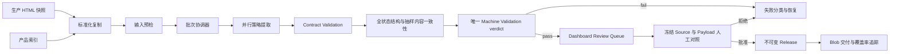

# AzureCNArchaeologist v0.1 → v1.0 路线图

> 文档状态：当前项目路线图  
> 最新稳定版本：v0.4.0
> 当前开发版本：Post-v0.4 re-baseline
> 基线日期：2026-08-04
> 适用范围：Azure 中国区产品 HTML 标准化、策略化解析、CMS JSON 导出与质量验证

## 1. 路线图目的

AzureCNArchaeologist 已在 v0.3 形成并通过全量验收的统一、可追溯、可恢复批次工作流。v0.4 Step 4 已完成抽样内容验证、受控人工审核、不可变 Release 和 Release-only upload gate；Step 5 已完成 Finding 门禁、successor Validation/Release routing、Dashboard/CLI accounting 与文档收口；Step 6 已完成可信回归基线、Core determinism record 和最终 full bilingual acceptance Batch；Step 7 已围绕该冻结 Batch 完成真实人工审核、代表 Release、dry-run、acceptance report 和版本冻结。v0.4.0 之后的下一项是 Post-v0.4 Roadmap Re-baseline Gate，不再回开 v0.4 scope。

从 v0.1 到 v1.0 的核心目标不是继续堆叠功能，而是把现有能力收敛为一套：

- 可用一个入口完成完整批次处理；
- 每次运行均可追溯、可恢复、可比较；
- 解析结果经过机器验证和人工核验；
- 支持范围和准确性有明确证据；
- 不再依赖失效代码和漂移文档；
- 只有通过质量门槛的结果才能被发布。

本路线图是版本演进的事实基线。旧的阶段文档可以作为历史参考，但其中的“已完成”声明不能替代当前代码、测试和验收结果。

## 2. v0.1 当前基线

### 2.1 已具备的主流程

当前系统实际包含三个阶段：

```text
阶段 1：生产 HTML 快照
data/current_prod_html/{language}/pricing/details/...
data/current_prod_html/{language}/SupportArticles/{articleType}/...

阶段 2：标准化输入
products-index.json
  → scripts/auto_copy_html.py
  → data/prod-html/{language}/pricing/{product_key}.html
  → data/prod-html/{language}/SupportArticles/{type-dir}/{product_key}.html

阶段 3：解析与导出
cli.py
  → ExtractionCoordinator
  → StrategyManager / PageAnalyzer
  → StrategyFactory
  → 具体策略
  → FlexibleContentPage 或 SupportArticlePage JSON
```

其中：

- `data/current_prod_html` 保存从生产环境取得的最新原始 HTML 快照；定价页位于 `pricing/details`，支持文章位于 `SupportArticles`；
- `scripts/auto_copy_html.py` 根据 Product Definition 中逐语言声明的精确 Source Location 复制并校验 HTML；
- `data/prod-html` 是解析管道使用的标准化输入；支持文章在每个语言下继续保留 `SupportArticles/{articleType}` 分类；
- 单产品和批处理最终复用 `ExtractionCoordinator`。

`SupportArticles/{articleType}` 是标准化输入和产物的 canonical 目录约定；生产快照的原始目录不用于推导 Support Article Type。

### 2.2 已实现的解析策略

| 策略 | 主要页面类型 | 当前代表产品 |
|---|---|---|
| `simple_static` | 无可见筛选器的静态定价页 | event-grid、service-bus |
| `region_filter` | 只有区域筛选的定价页 | api-management、azure-firewall |
| `complex` | 多筛选器、Tab 或复合映射页面 | cloud-services、virtual-machine-scale-sets |
| `support_article` | SLA、ICP、法律、公安备案文章 | icp-faq、sla-cognitive-services |

4 种策略的代表页面均能走通当前端到端提取链路。

### 2.3 v0.1 已知问题

当前项目仍属于内部 Alpha，主要问题包括：

1. 三段式流程存在多个分散命令，缺少一个批次级入口。
2. 批处理记录以单产品为主，缺少完整的批次清单和发布状态。
3. Flexible JSON 的当前输出与 CMS 契约说明存在字段和类型漂移，同时新旧验证规则混用，现有质量分数不可信。
4. 产品索引中的总数、产品列表、分类、配置路径存在不一致。
5. 现有测试大多是打印式诊断脚本，缺少有效断言和失败退出。
6. 尚未建立 Chrome 页面、原始快照和 JSON 预览之间的人工核验闭环。
7. `large_file` 会被策略管理器选择，但没有对应的已注册实现。
8. 部分 CLI 导出命令、参数和状态说明已经失效。
9. README 和部分 `docs/` 文档包含大量未实现或过期声明。
10. 缺少基于准确性证据定义的产品支持矩阵。

## 3. v1.0 目标架构


```mermaid
flowchart LR
    A[生产 HTML 快照] --> B[标准化复制]
    I[产品索引] --> B
    B --> C[输入预检]
    C --> D[批次协调器]
    D --> E[并行策略提取]
    E --> F[Contract Validation]
    F --> G[全状态结构与抽样内容一致性]
    G --> M[唯一 Machine Validation verdict]
    M -->|fail| X[失败分类与恢复]
    M -->|pass| H[Dashboard Review Queue]
    H --> J[冻结 Source 与 Payload 人工对照]
    J -->|拒绝| X
    J -->|批准| K[不可变 Release]
    K --> L[Blob 交付与覆盖率追踪]
```

v1.0 中需要清晰区分：

- **Source snapshot**：未经修改的生产 HTML 快照；
- **Normalized input**：按照语言、内容类型、Resource Key 和可选版本身份组织的字节级一致解析输入；Catalog Category 仅为元数据视图；
- **Batch run**：一次具有唯一 ID、输入清单和代码版本的全流程运行；
- **Extracted output**：策略提取完成但尚未批准的结果；
- **Validated output**：通过机器验证的结果；
- **Approved output**：经过必要人工核验、允许发布的结果；
- **Published output**：已交付 CMS 或外部存储的正式产物。

## 4. 版本演进总览

| 版本 | 主题 | 核心结果 |
|---|---|---|
| v0.1 | 当前基线 | 4 种策略和分散的三段式流程可运行 |
| v0.2 | 事实与契约收口 | 产品全集、CMS 契约和状态边界统一 |
| v0.3 | 批次工作流 | 一个入口完成标准化、解析、验证和报告 |
| v0.4 | 可信、可审核、可发布的最小完整版本 | 全状态结构验证、可复现抽样内容验证、Finding 分级、Dashboard 审核、不可变 Release 和可信回归基线 |
| v0.4.1 | 已知缺陷修复与新基线 | 修复 SLA route map 路径不一致、已确认的桌面/移动默认项问题、错误分类、日志与文档问题，冻结新的 accepted Batch |
| v0.5.0 | 独立内容核对探索 | 用四类真实 Frozen HTML 判断独立源内容定位是否可行；只形成设计依据，不增加生产能力 |
| v0.5.1 | 重建依据与证据规则 | 根据探索结果定义依据版本、历史证据语义、规范化版本和两类机器检查边界 |
| v0.5.2 | 单产品生产闭环 | 以 `api-management` 跑通独立源内容核对 |
| v0.5.3 | 四类核心页面覆盖 | Core 8 产生策略重放与独立核对两类结论，Workbench 分开显示 |
| v0.5.4 | C2 同类结构问题 | 先归因和必要拆分，再修复适用的 software target 问题 |
| v0.5.5 | C1 简单页正文边界 | 为 SimpleStatic 建立可证明的正文边界 |
| v0.5.6 | C9 扩展与 v0.5 收口 | 扩展 RegionFilter/Complex 边界，拆分 C4，冻结 v0.5 基线 |
| v0.6 | 第二批结构问题与 CMS 暂存检查 | 推进 C3–C8，并验证 Release 在 staging CMS 往返后的结构化内容一致性 |
| v0.7 | 长尾与生产化 | 只在真实证据支持时建设 streaming、真实发布和长尾支持 |
| v0.8 | 架构清理 | 删除 stale 代码，收缩 CLI、依赖和重复职责 |
| v0.9 | 发布候选 | 全量演练、缺陷收敛、文档重建和发布冻结 |
| v1.0 | 稳定版 | 可重复、可验证、可审核、可安全发布 |

版本号表示能力和质量门槛，不表示固定日历日期。后续版本只有在当前版本验收条件全部满足后才能升级。

## 5. 分版本路线图

### v0.2：建立可信事实基线

> 状态：已完成（2026-07-21）。自动化门槛、双语快照闭环、代表 payload CMS 测试导入、内容核验及 SLA 历史版本路由验证均已通过；证据见 `reports/v0.2/acceptance-status.md`。

#### 目标

先解决“产品有多少、支持什么、输出应该长什么样、成功如何定义”等基础问题。

#### 主要工作

- 以 Product Definition 1.0 作为产品全集的唯一事实来源，包括 Product Key、slug、能力状态、多分类成员关系、逐语言 Source Location，以及不增加产品计数的可发布 SLA 历史版本资源；`products-index.json` 是可重复生成并校验漂移的 Product Index 3.0。
- 修复 `products-index.json` 中的：
  - 重复产品；
  - 分类数量漂移；
  - 分类名称拼写错误；
  - 配置目录不一致；
  - 单值 category 与跨分类重复定义；
  - URL、slug 和标准化文件路径不一致。
- 将 CMS 同事提供的两份文档登记为上游契约说明基线：
  - `docs/cms-json-new-schema/FlexibleContentPage-JSON-Schema-1.1.md`；
  - `docs/cms-json-new-schema/SupportArticlePage-JSON-schema.md`。
- 明确区分三类契约证据：
  - **CMS 契约说明**：上游提供的 Markdown 文档和示例；
  - **本地机器契约**：由说明文档和确认结论生成的可执行 JSON Schema；
  - **CMS 导入证据**：代表 payload 在 CMS 测试环境被成功接受的记录。
- 将已经与 CMS 确认的规则作为 v0.2 本地机器契约基线：
  - `leftNavigationIdentifier` 必填，值取自原始 HTML 的 `ms.service`；缺失或为空时验证失败；
  - `filtersJsonConfig` 是 JSON 字符串，内部使用 `filterDefinitions`；当前定义使用 `filterKey`、小写 `filterType`、`displayName` 和 `options`，选项使用 `value`、`label`、`href`；
  - `filterCriteriaJson` 是 JSON 字符串，内部值为筛选条件对象数组；每个条件的 `matchValues` 是字符串值；
  - `sectionTitle` 允许为空；
  - Flexible 业务 JSON 中未在契约说明里声明的字段（例如 `language`）由 CMS 忽略，不因这些字段存在而导入或验证失败；
  - SupportArticle 业务 JSON 的 `pageType` 只能输出大写 `SLA`、`LEGAL`、`ICP`、`PSR`；
  - SupportArticle slug 仍由逐产品配置维护，生成的 `products-index.json` 必须包含同值 slug。
- 建立 SupportArticle 类型、CMS `pageType` 和 canonical 标准化/产物目录的固定映射；该映射不约束生产 Source Snapshot 的原始目录：

  | 支持文章类型 | CMS `pageType` | `{articleType}` 目录 |
  |---|---|---|
  | SLA | `SLA` | `SLA` |
  | 法律 | `LEGAL` | `Legal` |
  | ICP 备案 | `ICP` | `ICP` |
  | 公安备案 | `PSR` | `PublicSecurityRegistration` |

- Source Snapshot 由 Product Definition 的 `sources.zh-cn/en-us.snapshot_path` 精确定位，标准化输入使用 `data/prod-html/{lang}/SupportArticles/{articleType}/{product_key}.html`。
- `scripts/auto_copy_html.py` 不再包含特殊映射、目录猜测或首个 HTML 回退；复制后 source/normalized SHA-256 必须一致。
- `options.isDefault` 和 `order` 在 CMS 进一步确认前不进入 v0.2 业务契约；后续若增加，必须升级本地契约版本并补充导入回归。
- 生成并冻结两套 CMS 业务 JSON 的机器可执行 Schema；Flexible 使用已明确的 1.1 版本，SupportArticle 在 CMS 确认后建立本地契约版本并记录上游文档哈希。
- 明确业务 JSON 与运行诊断的边界：CMS 业务 payload 保持纯净，提取元数据、验证结果和错误信息进入独立 sidecar。
- 统一字段命名、契约版本和 sidecar 结构。
- 使用正交状态维度，避免将“提取成功但验证失败”压缩为一个含糊状态：
  - execution：`pending`、`running`、`succeeded`、`failed`、`skipped`；
  - validation：`not_run`、`passed`、`failed`；
  - review：`not_requested`、`pending`、`approved`、`rejected`；
  - publication：`not_published`、`published`。
- 生成当前产品 × 语言 × HTML × 策略的基线清单。

#### 交付物

- 可程序化验证的产品索引。
- 两套 CMS 业务 JSON 的机器可执行 Schema。
- 业务 JSON 与诊断 sidecar 的边界及 sidecar 结构定义。
- CMS 契约说明—本地 Schema—当前代码的字段一致性矩阵。
- 契约确认记录 `docs/cms-json-new-schema/CONTRACT-CONFIRMATIONS.md` 和 CMS 测试导入证据。
- 当前覆盖率基线报告。
- 统一的错误分类和运行状态定义。
- v0.1 代表产品的基准输出快照。

#### 验收标准

- 索引中产品总数等于唯一产品列表长度。
- Product Key 全局唯一；同一 Product Definition 可以出现在多个 catalog category 视图中，分类成员数之和允许大于唯一产品总数。
- 每个索引产品都能定位到配置文件，或被明确标记为不支持。
- 配置、标准化路径、slug 和 URL 的差异均有明确规则。
- 所有产品 slug 均满足 CMS 契约，或存在经 CMS 确认并记录的兼容例外。
- 生成索引中每个产品的 slug 与对应逐产品配置一致，不存在第二个可独立修改的 slug 来源。
- Flexible 的 `leftNavigationIdentifier` 非空且来自 `ms.service`；`sectionTitle` 为空不被判定为契约错误。
- `filtersJsonConfig` 符合已确认的 `filterKey`/`filterType`/`displayName`/`options` 结构，v0.2 不擅自输出尚未确认的 `options.isDefault` 和 `order`。
- `filterCriteriaJson` 内部是条件对象数组，`matchValues` 按字符串验证，并能与同一 `filterKey` 下的选项值对应。
- Flexible 业务 JSON 中的 `language` 等未声明字段被容忍并忽略，不导致本地 Schema 验证或 CMS 导入失败。
- SupportArticle 仅输出 `SLA`、`LEGAL`、`ICP`、`PSR` 四个大写 `pageType`；类型来自 Product Definition，而 Source Snapshot 和标准化 HTML 分别按显式 Source Location 与 canonical type directory 定位。
- `service-bus`、`dns`、`api-management`、`cloud-services`、`icp-faq` 五个代表产品均通过本地机器契约和 CMS 测试导入；Event Grid 在生产源页面修复前明确排除。
- Flexible 业务 payload 可以保留 CMS 会忽略的未声明业务字段（例如 `language`）；项目仍不主动把 `validation`、`extraction_metadata`、错误和来源信息混入业务 payload，而是写入诊断 sidecar。
- `filtersJsonConfig` 和 `filterCriteriaJson` 的外层与内层结构均通过验证，筛选器定义、选项和内容组条件能够相互对应。
- Flexible 输出不再被旧版字段规则错误判定为无效。
- 4 种策略至少各有一个固定基准样例。

### v0.3：建立统一批次工作流

> 状态：已完成。v0.3 全量双语验收于 2026-07-21 通过，项目版本已升级为 v0.3.0。

#### 目标

将当前分散的三个阶段串联成一个可观察、可恢复的批次。

#### 正式 CLI 接口

```bash
uv run cli.py pipeline-run --all --language both
uv run cli.py pipeline-run --group database --language zh-cn
uv run cli.py pipeline-status --batch-id <batch-id>
uv run cli.py pipeline-resume --batch-id <batch-id>
uv run cli.py pipeline-validate --batch-id <batch-id>
```

#### 批次阶段

```text
snapshot discovery
→ normalize/copy
→ preflight
→ extract
→ validate
→ create review queue
→ report
```

#### 主要工作

- 引入批次级协调器，不复制现有提取业务逻辑。
- 复用：
  - `HTMLFileCopier`；
  - `ProductManager`；
  - `BatchProcessEngine`；
  - `ExtractionCoordinator`；
  - 现有 4 种策略。
- 为每次运行生成唯一 `batch_id`。
- 记录：
  - Git commit；
  - 产品索引哈希；
  - 输入文件哈希；
  - 语言和处理范围；
  - 使用策略；
  - 输出路径；
  - 错误和耗时；
  - 验证及审核状态。
- 支持失败隔离、断点续跑和幂等重跑。
- 未经批准的结果不得自动进入发布阶段。

#### 固定批次目录

```text
runs/{batch_id}/
├── batch-manifest.json
├── input-manifest.json
├── outputs/{language}/pricing/{resource}.json
├── outputs/{language}/SupportArticles/{articleType}/{resource}.json
├── diagnostics/{language}/pricing/{resource}.sidecar.json
├── diagnostics/{language}/SupportArticles/{articleType}/{resource}.sidecar.json
├── validation/{language}/pricing/{resource}.validation.json
├── validation/{language}/SupportArticles/{articleType}/{resource}.validation.json
├── review/review-queue.json
├── logs/pipeline.jsonl
└── batch-report.json
```

Pricing 始终写入 `{language}/pricing`；同一 Product Definition 即使属于多个 catalog category 也只生成一份产物，category 仅作为元数据。`batch-manifest.json` 是唯一可变状态真源，validation、review queue、sidecar 和 report 均为可重建投影。

#### 验收标准

- 一个命令可以完成标准化复制、批量提取、验证和报告。
- 同一批次可在失败后从中断阶段继续。
- 重跑不会产生无法区分的重复正式产物。
- 单个产品失败不会中断整个批次。
- 每个产物都能追溯到源 HTML、配置、代码版本和批次。
- 批次报告能够准确汇总成功、失败、跳过和待审核数量。

#### 验收结果

- 全量双语批次共规划 434 项：379 项可运行且全部完成抽取与验证，54 项按 `known_unsupported` 跳过，1 项按历史源不可用跳过。
- 批次退出码为 `0`，七个阶段全部成功，379 项进入 review queue，434 项 publication 均保持 `not_published`。
- 无操作恢复保持 manifest、review queue、report 和 JSONL 日志逐字节不变；独立复核确认所有可运行项的 normalized input、payload、sidecar 和 validation 哈希一致。
- 42 个 `unittest` 回归测试全部通过，包含既有 17 个 v0.2 基线测试和 25 个 v0.3 测试。
- 完整证据见 [`reports/v0.3/acceptance-status.md`](reports/v0.3/acceptance-status.md) 和机器可读摘要 [`reports/v0.3/full-run-summary.json`](reports/v0.3/full-run-summary.json)。

### v0.4：建立可追溯内容验证与最小批准交付闭环

> 状态：已完成。Step 4 Slice A-E 的能力实现已完成，Step 5 已完成 Finding Policy successor、Review/Release routing、Dashboard/CLI accounting 与文档同步，Step 6A 已冻结真实双语 Core Matrix baseline，Step 6B 已通过 `core-determinism-comparator-v1`，Step 6C 已冻结最终 full bilingual acceptance Batch `20260806T044456Z-e6268660`，Step 7A 已完成最终自动化验收重跑，Step 7B 已完成真实人工审核，Step 7C 已生成代表 Release `v0.4.0-step7c-representative` 并通过 verify/dry-run，Step 7D 已生成 `reports/v0.4/acceptance-status.{json,md}` 并升级为 `0.4.0`。

#### 目标与保证边界

将 `validation=passed` 从“成功生成且结构合法”升级为：

> 在冻结的 Source Snapshot 和 Validation Profile 下，对全部 source-proven Reachable Selection States 证明 CMS 结构契约成立，并证明由 Batch Item Sampling Plan 选中的内容状态与 persisted Business Payload 一致。

Page-global、SimpleStatic 和 SupportArticle 主体内容执行完整比较；RegionFilter 和 Complex 的 state-specific 内容执行确定性分层抽样比较。报告必须公开 `sampled / total`、未测试状态数、seed、exact state identities 和绑定哈希。通过结果不得被描述为未抽中状态的完整内容证明、完整 Pricing Fact Fidelity、视觉等价或外部 **Commercial Price Accuracy**。

Frozen Source Snapshot 仍是批次内容权威。当前 live 页面只作 non-authoritative interaction reference，不能自动改写 Source Snapshot、抽样计划、验证结论或 Golden。

v0.4 Step 5 已实现可日常使用的最小闭环能力：机器通过项进入 Dashboard Review Queue，Source Warning、Approval Blocked、Machine Failed 与 Release Ready 独立 accounting，实际被审核的产品语言项显式 approved 或 rejected，其余保持 pending；批准项生成不可变 Release，upload 只接受 sealed Release。Step 6 已建立可信回归和最终全量证据，Step 7 完成真实产品演练、release-readiness 验收与 v0.4.0 基线冻结。

v0.4 不包含 GitHub Actions、required branch checks、Dashboard 公共托管、多用户权限或自动 CMS 发布；它交付 runner-agnostic、可被未来自动化平台调用的本地流程和 CI-ready 测试能力。

#### 实施顺序

##### P0：隔离导出 `virtual-machines` 实验产物

这是 v0.4 的最高优先级实施切片，但不属于正式支持资格提升：

- 新增独立 `experimental-extract` 命令，不向正式 `extract` 或 pipeline 增加通用 `--skip-validation`；
- 使用 closed-world `data/configs/experimental-extraction-exceptions.json` 精确允许 canonical Product Key `virtual-machines`，绑定 Product Definition-resolved source path、语言、强制 `complex` 策略、逐语言字节数与 SHA-256、原因、责任团队、资源上限、输出根和到期条件；
- 输入直接读取 `data/current_prod_html/{language}/pricing/details/virtual-machines/index.html`，不复制到 canonical `data/prod-html`，也不允许任意 `--input-file`；固定 `zh-cn` 为 8,064,052 bytes / SHA-256 `b1eedddb9020c94399063f95cc746609c1c86ec658fba5457d8d84197a2ea19f`，`en-us` 为 7,239,577 bytes / SHA-256 `8d0167fe4aa7e196b1879941d6830b3ef30f7e448501e53706823d736e827ea1`；
- 实验上限固定为 8 MiB input、900 seconds wall time 和 2 GiB peak RSS，输出根固定为已被 Git 忽略的 `output/experiments/{experiment_id}/{language}/`；任何调整都必须经过 Specification review；
- Specification 在任一源哈希变化或 v0.4 完成时到期，以较早者为准；任何产品、语言、策略、哈希或大小不匹配都在提取前失败；
- `zh-cn` 优先满足当前离线研究请求；P0 只有在 `zh-cn` 与 `en-us` 都独立生成 Experimental Payload Candidate 与成功 Manifest 后才完成，任一语言资源或提取失败都使 P0 保持 blocked/failed，但不妨碍并行推进无依赖的 v0.4 基础工作；
- 仅执行输入存在性、严格 UTF-8、SHA-256、资源限制、解析执行和 JSON 原子写入等 execution-safety checks，不执行 CMS Contract、Sampled State Content Consistency 或其他内容质量验证；
- 在隔离进程中执行并记录资源数据，输出到 gitignored 实验目录；成功必须完整生成 `{resource}.unvalidated.json` 和 `experiment-manifest.json`，失败时删除临时或部分 Candidate，只向内部执行日志写诊断，不生成失败形态的交付 JSON；
- Manifest 固定标记 `trust_status=unvalidated`、`approval_eligible=false`、`publishable=false`，并记录强制策略、源哈希、原因和时间；
- 实验产物不得进入 canonical Batch outputs、Review Queue、Golden、Sampling Baseline、Release、正式 upload 或 publication；Product Definition 继续保持 `known_unsupported`；
- 命令返回 `0` 只表示实验 JSON 与 Manifest 已生成，输出文案必须为 `EXPERIMENTAL OUTPUT GENERATED — UNVALIDATED` 而不是 `PASS`；策略、输入、资源或执行失败返回 `1`。

##### P1：配置、输入与运行能力边界

- Product Definition 使用版本化 closed-world 机器契约；未知、拼写错误或废弃字段先作为校准 finding，必须在 v0.4 结束前显式晋升为阻断；
- Product Key、Resource Key、页面模型、语言、Source Location 和 canonical 路径必须一致；Catalog Category 只作为元数据视图，不参与源或产物路径推导；
- Normalized Input 必须与 Source Snapshot 字节级一致并校验 SHA-256，不转码、不换行归一化、不修复 HTML；
- 仅接受严格 UTF-8，保留 BOM；非法字节阻断。可靠 charset 声明与实际字节不一致时记录 Source Quality Finding；
- HTML 门禁采用 Reconstruction Parseability：独立解析和结构探测必须对关键内容达成可解释一致，普通 lint 问题本身不阻断，关键内容丢失或结构分歧阻断；
- Reconstruction Parseability 后、正式提取前运行只读 Source HTML Structure Audit：仅对高置信度 wrapper、section nesting、control-boundary 和 emitted-fragment identity 异常输出源 SHA、精确行号、DOM 证据与上游修改建议；不得改写 canonical/normalized bytes、在内存中套用候选补丁、更新 Product Definition 或 baseline。普通可忠实复制的源异常保持 Source Quality Finding；若同一待发布片段内的重复 ID、归属歧义等问题无法在不修源或不猜测的前提下形成 contract-valid Payload，则作为 Blocking Source Structure Finding 在 Payload 生成前失败。只有 parser、可见文本、表格、脚本、控件、target 与 reachability 身份均保持不变时才可附带保守 patch candidate；
- 每个 Batch Run 冻结完整 Validation Profile，包括 Local Machine Contract、规则及严重度、Content Sampling Profile、基线引用和 InMemory Capability Profile；Source Reachability 确定后再为每个 Batch Item 冻结精确 Sampling Plan。input/batch manifest 与报告分别保留 Profile 与 Plan 身份，`pipeline-validate` 必须重放两者；现有 `v0.4-desktop-p1` 继续冻结 Desktop Interaction Authority，v0.4 只是不再新增用于 Complex Table Visual Review 的 Chromium/font/CMS/CSS Rendering Profile 与 Variant 门禁；
- 以 v0.3 已验收的 379 个语言级 runnable items 生成不可变 v0.4 Planning Baseline Manifest。自动 preflight 只能提出 planned non-runnable 建议；任何分母变化必须经独立审核，记录 prior/proposed state、原因、证据和 Product Definition capability decision 后，才能冻结 v0.4 runnable set；
- 文件大小不再决定语义策略。删除未实现的 `LARGE_FILE` 语义选择路径及其 fallback；v0.4 的 in-memory 初始候选上限是 `5 × 1024 × 1024` bytes，只有在最大真实输入、近上限压力样例、峰值内存和耗时通过重复确定性测试后才能冻结，否则下调；
- 超过冻结能力上限的正式输入在 planning/preflight 阶段标记 `non_runnable: input_exceeds_in_memory_profile`，不得提取、不得降级为 `Simple`、不得伪装成运行后 skip。P0 实验例外不改变正式边界。

##### P2：CMS 契约与筛选状态验证

- Contract Validation 与内容验证分别保留证据，但共同汇总为唯一 Machine Validation 结论；
- FlexibleContent 与 SupportArticle 使用各自独立的 Local Machine Contract；删除旧字段验证和 `quality_score` 计算逻辑；
- `filtersJsonConfig` 与 `filterCriteriaJson` 除了是合法 JSON 字符串，还必须满足完整嵌套语义契约，并采用 deterministic canonical serialization；`matchValues` 继续按单个字符串验证；
- Filter domain 在每个适用 parent scope 内必须非空、机器身份无歧义且完全覆盖；Default CMS State 沿冻结源证明的默认条件路径形成。v0.4 以每个 scope 的 desktop interaction control 作为本语言 option label 与顺序事实源：branch default 移至该 scope 首位，其余 sibling 保持 desktop 相对顺序；对应 mobile control 必须具有相同 scoped machine set，但不决定默认项、label 或顺序。Mobile label 漂移形成 Source Quality Finding，机器集合漂移仍阻断；post-v0.4 按 ADR-0090 忽略移动端重复或冲突的默认标记，桌面默认项自身不明确时仍阻断；
- CMS state space 是由冻结 Source Snapshot 与 Source Reachability Evidence 独立证明的有序 Reachability Relation。彼此独立的 domain 只在同一 scope 内形成笛卡尔积；software-specific Category 等 Conditional Filter Domain 只与其 parent branch 组合，禁止把 sibling options 合并后生成理论 cross-branch states，也禁止由待验证 Payload 自行声明完整性；
- Business Payload 以一条 active `contentGroup` 对应一条 Reachability Relation row；CMS 导入以这些 groups 为状态与渲染真源，不会从 `filterDefinitions` option catalog 自行生成额外组合。`groupName` 必须按状态路径中同语言 Desktop Localized Source Display Label 以精确 ` - ` 连接为 `region - software - category`（例如 `zh-cn` 使用 `中国东部 2`，`en-us` 使用 `China North 3`），缺失维度只允许因该路径无此 filter 而省略；segment 自身包含该 delimiter、名称与 criteria 不一致或段数漂移均阻断；
- 对任意产品，Category 中 label 为 `All`/`全部` 且声明 target panel 不存在的选项统一视为 Non-materialized Aggregate Tab：从 option catalog 与 Reachability Relation 省略，不合成、不输出 placeholder、不复制 sibling 价格；该 scope 的首个剩余 concrete Category 成为默认。其他 missing target 仍为阻断错误；
- 每个可达状态恰好命中一个 active、非空、非 placeholder 的 `contentGroup`，且通常必须 price-bearing；唯一窄例外是由冻结 Source Reachability/Configuration Evidence 证明源配置有意排除了该状态全部适用价格片段的 Source-confirmed Empty Selection State。该例外必须保留剩余源内容、记录 Source Quality Finding，不能由空提取结果反推，也不能虚构价格；零匹配或多匹配仍阻断；
- 每个 active group 必须包含其 Reachable Selection State 路径中全部 active filter keys，每个 key 恰好匹配该 conditional scope 已声明的一个 option value；禁止 wildcard、缺少 path-active key 和多值编码；
- 双语允许 label 本地化，但 filter keys、scoped option identities、parent-child topology、Reachability Relation、Default CMS State 和机器状态顺序必须一致。真实源侧差异形成 Bilingual State Drift finding 并阻止批准，提取器制造的差异直接失败；
- 生成 payload 不保留 inactive group、section、placeholder 或 stale 字段；`sortOrder` 在同一数组内必须为正整数、唯一且升序，允许间隔；
- 严格验证 `pageType`、`enableFilters`、filter topology、`contentGroups` 与 `baseContent` 的 Flexible Page State Machine；删除未知策略、页面分析异常和未知 page type 到 `Simple` 的静默 fallback；
- `baseContent` 表示不随任何 Reachable Selection State 变化且只输出一次的 Page-Global Content，与 `simple_static`、`region_filter`、`complex` 策略正交；期望值必须由 canonical source boundary 与冻结证据决定，禁止从策略推断为空。最后一个正式 selector 之后、精确 FAQ/SLA 之前的直接可见 pricing section 仅是候选；未声明候选、身份漂移、隐藏/交互内容、越过公共区块边界或向 group/Qa 重复均阻断。Simple 也不得回退到整个 `.pure-content`/`body`：无法证明精确业务主体时形成 Unproven Page-Global Boundary 并失败；`baseContent` 与任一完整 `commonSections.content`、`contentGroups.content` 或受控 `sharedContent` 的 Content Ownership Overlap 同样阻断；
- 删除无证据的遗留 `sharedContent` 生产和兼容逻辑：global 内容进入 `baseContent` 或 `commonSections`，state-specific 内容进入对应 group，无法安全确定 ownership 的源片段形成 Source Finding。若源在一个 Software panel 内、首个 concrete Category panel 之前声明不随其他 active filter 改变的 Software-scoped Prefix Content，则以 panel、scope 和源 HTML 指纹证明其身份，并前置投影到该 software 下每个源证明可达状态的 `content`。唯一允许的 `sharedContent` 是 Region-Projected Shared Content：源 ancestor fragment 必须 price-bearing、由 active region 与冻结 `soft-category.json` 证明确切投影，并在每个适用 descendant state 上逐项绑定 source/config/projected hash；禁止无证据字段、跨 region 泄漏、提升为全页 common content或只归入首个 Category。
- `soft-category.json` 只选择具有非空 `id` 的表；无 ID 表属于其源状态的无条件内容，必须原样保留，并冻结物理表序、规范化 HTML SHA 与聚合身份。重复 `(os, region)` 条目或单条目内重复 normalized table ID 都写入确定性上游配置报告；后者虽不改变 selector set，也不得在运行时静默去重。仅当重复 ID 与当前可达状态相关时在 Payload 前阻断，状态无关时保持 report-only。

##### P3：全状态结构契约、抽样内容一致性与最小交付闭环

- 复用 P2 的完整 Source-proven Reachability Relation；所有状态继续执行 filter topology、criteria、唯一 contentGroup、默认状态、missing/extra/duplicate、inactive/placeholder 和 ownership 结构验证，结构层不抽样；
- page-global、SimpleStatic 和 SupportArticle 主体内容执行完整比较；RegionFilter 和 Complex 的 state-specific 内容按冻结 Content Sampling Profile 执行确定性分层抽样；
- Content Sampling Profile 固定 mandatory default、strategy-specific strata、样本预算、seed derivation 和算法版本；Source Reachability 确定后，Batch Item Sampling Plan 冻结 universe identity、derived seed、strata instances 和 exact selected states。状态数不超过预算时全量比较；相同 Source/item/Profile 必须选择相同状态；
- Payload hash 不进入 seed。被选状态无法建立 Source 对照、解析失败或发生 mismatch 时明确 validation failure，禁止丢弃失败样本后 replacement draw；
- 每个 selected state 比较冻结 Source 与 persisted Payload 的完整展示内容、价格与单位文本、表格、片段顺序、multiplicity 和 state assignment；本阶段不解析逐项 Pricing Facts，不建立 Applicability Map、StateProjectionMap 或完整 Expected/Observed/Diff inventory；
- validation projection 至少记录 Source/Payload/Profile/Sampling Plan hashes、全状态结构结果、coverage mode、universe/selected/untested counts、seed、strata、exact state identities、per-sample diff、Approval Eligibility 和 blockers；
- Machine-pass P3 Batch Items 全部进入 Review Queue 2.0，初始 `review=pending`。审批单位是 Resource Key + Language，未审核项目不因同批其他样本通过而隐式批准；
- 当前 CLI 已提供 `pipeline-review-list`、`pipeline-review-decide` 与本地 `pipeline-review-serve`，并通过 CLI 和 Dashboard 共用的受控 service 写入 append-only decision、更新 `batch-manifest.json` current decision reference 和 binding。`approval_eligible` 必须由 execution、validation 与当前 Approval Blockers 独立派生，不能由 approve/reject verdict 或 decision binding 赋值；
- Dashboard 已保留 `/` 只读能力账本，并新增 `/review` 本地审核工作台，分别呈现 Batch、Machine Validation、Review、Evidence Binding、Release-ready 只读派生值、Release reference 和 Publication reference；approve/reject 必须调用与 CLI 共用的受控服务，Dashboard 不直接编辑投影或 manifest；
- Review Decision append-only，绑定 reviewer、时间、Source/Payload/validation hashes、Sampling Plan、人工检查状态、verdict、reason 和 notes。Step 5 将 Source Quality Finding 按冻结 code policy 分为 advisory 与 approval-blocking：advisory 不再自动生成 blocker，approval-blocking 仍保持不可批准；机器失败不能人工覆盖，证据变化使旧决定 stale。Approval Eligibility 只表示 Machine Validation 与 Finding Policy 的批准前置条件，合法 current-hash-bound Review Decision 独立产生 `review=approved`；两者不得压缩为同一状态；
- 只有 `execution=succeeded + validation=passed + approval_eligible=true + review=approved + evidence_binding=bound` 且 decision 绑定全部当前哈希的项目可以复制到 write-once `output/releases/{release_id}`；Release build/verify 还必须重放 bound Validation Profile、Finding Policy 与 canonical preconditions，异常的 legacy `approved + finding` 不得 grandfather。一个 Release 只绑定一个 Batch，并由 canonical Release Manifest SHA + 全 payload hashes 原子 seal；
- upload gate 只接受 sealed Release Manifest，不扫描任意 output 目录。上传成功后才记录 publication receipt 和 `published`，失败可对同一 Release 幂等重试；
- 报告和 UI 必须明确这是 Sampled State Content Consistency，不得声称未抽中状态、全部 Pricing Facts、Commercial Price Accuracy 或视觉等价已被证明。

##### P3 核心能力：Dashboard 审核工作台

- 已保留现有 `/` capability ledger、分类筛选、机器/人工证据分轨和 stale binding 能力，并新增本地 `/review` Batch Workbench；
- Workbench 通过 `pipeline-review-serve` 的 loopback bridge 显式选择 Batch，不按磁盘时间自动选最新；bridge 校验 Host、Origin、Bearer token、Batch allowlist、请求形状、Content-Type 和 manifest revision；
- 总览分别统计产品和产品语言项的 runnable、pending、approved、rejected、Source Warning、Approval Blocked、Machine Failed 和 Release Ready，不把 warning 与 blocker 压缩成 `source-blocked`，也不把这些状态压缩为一个“支持率”。机器可读 JSON/schema 使用 `source_warning`、`approval_blocked`、`machine_failed`，计数字段为 `source_warning_count`、`approval_blocked_count`、`machine_failed_count` 和 `release_ready_count`；
- 上述统计是独立维度：`source_warning_count` 统计至少含一个 advisory finding 的 item，可与 `approval_blocked_count` 重叠；`approval_blocked_count` 统计 `validation=passed` 且至少含一个 Approval Blocker 的 item；`machine_failed_count` 统计 `validation=failed` 的 item，在最终 verdict 下与 approval blocked 互斥；`release_ready_count` 只统计 execution succeeded、validation passed、eligible、approved、bound 且 decision 绑定当前 hashes 的 item，可与 source warning 重叠。这四个 count 不是总数可相加的互斥分区；
- 审核工作区显示冻结 Source、persisted Payload、机器抽样覆盖、人工检查状态、decision history、stale binding 和 Release/Publication 只读引用；人工样本优先覆盖机器未抽中的组合；
- approve/reject 是受控命令入口，必须经后端 review domain service 写入 append-only decision 并更新 `batch-manifest.json`；前端投影本身仍非权威，状态落盘并重建投影后才刷新显示；
- 拒绝原因至少区分 upstream_source、product_config、extractor_defect、validator_defect 和 needs_clarification；
- Dashboard 必须显示显式 Batch/Release identity、Source/Payload/Profile hashes、`sampled / total`、当前绑定、legacy_unbound 和 stale，不能按文件时间静默选择“最新”结论；
- Dashboard 不改变 Pipeline Machine Validation verdict，也不允许人工覆盖 machine failure；它是 Step 4 人工审核的必要工作面，但不是验证或生命周期真源。

##### P4 / Step 5：Source Finding 分级与批准门禁收敛

- 冻结一个小型、静态、closed-world 的 Finding Code Policy；每个当前会进入 `source_quality_findings[]` 的 code 必须显式分类为 `advisory` 或 `approval_blocking`，未识别 code 默认 fail closed 并阻止批准，直到通过正式决策补充分类；
- 只有已经由冻结源证据证明不会造成状态、ownership、target、criteria 或内容歧义的 Finding 才能列为 advisory。初始 advisory 范围只包含严格 UTF-8 已通过时的 charset 声明问题，以及 desktop 仍为权威时的 mobile label 漂移；source-confirmed empty selection state 按 ADR-0074 继续 approval-blocking，双语 source-proven state/reachability 漂移同样继续 approval-blocking；
- 结构、ownership、target、criteria、state mapping、sampled content mismatch 和其他现有 Machine Validation failure 继续直接失败，不得降级为 Finding 或由人工覆盖；
- advisory 完整保留在 Validation Evidence，并由 CLI/Dashboard 显著展示；它不生成 Approval Blocker。审核人在看到当前 warning 后作出的 Review Decision 继续绑定包含这些 Finding 的 validation evidence hash，v0.4 不新增 acknowledgment 字段、Disposition schema、override 或 exception 状态机；
- Finding Code Policy 的 version/hash 通过 Batch code provenance 与 validation identity 冻结，并参与 Validation Evidence identity。冻结的 P3 Profile 1.2 / Pipeline Validation 2.0 保持字节与 blanket-blocker 语义不变；新 Batch 使用最小的 Validation Profile 1.3 P3-successor identity 与 Pipeline Validation 2.1。Profile 1.3 显式继承 exact P3 1.2 tuple，保持 Content Sampling Profile、Sampled Content Evidence 1.0 与其他 P3 identities 不变，canonical 地拥有 `finding_code_policy_identity`；Validation 2.1 evidence 投影同一 identity 并要求逐字段相等，在 evidence 内按该冻结 policy 生成 source preconditions。Step 6 semantic identities 只写入独立 comparator record，不回填或修改 Sampled Content Evidence 1.0。该 successor 只解决版本兼容与可审计 policy identity，不增加 P4 内容或视觉保证；successor exact id/path/hash 由新 ADR 冻结；
- Sampled Evidence 1.0 继续绑定 exact base P3 1.2，runtime 将其 bindings 与 Validation 2.1 bindings 分开构造；Validation 2.1 再绑定 successor、policy 与原始 Sampled Evidence。StateStore、ReviewService 和 Workbench 必须 closed-world 路由 2.1，并保留 write-once、自身份与 profile-policy replay，不能落入 Validation 1.0 或 mutable generic writer；
- 为新 acceptance Batch 新增最小 Release Manifest 1.1，绑定 Profile 1.3、Validation 2.1 与 policy；Release Manifest 1.0 保持只读可验证，Publication Receipt 1.0 继续绑定已验证 Release artifact；
- legacy fallback 白名单只包含 `(id=v0.4-validation-p3, schema_version=1.2, path=data/configs/validation-profiles/v0.4-p3.json, sha256=fbbfa8bd937779748e86f48f738af5c561f164bf2e10615efe2515d45ba3ae1b)`。该 exact tuple 缺少 policy identity 时固定使用 `legacy-all-source-findings-block-v1`：无 finding item 在满足其他门禁时仍可审核/Release，任一 Source Finding 都阻止 approve 但允许 reject。只有 `exact old P3 + policy absent` 与 `exact successor + Profile/evidence policy valid and equal` 合法；P1/P2、未知/漂移 profile、旧 P3 意外携带 policy、successor 缺失或 mismatch 全部 fail closed。不调用当前 registry 重分类，不向旧 Batch 回填 identity；需要使用新 policy 时创建新 Batch；
- policy evaluation 必须按 profile/validation version dispatch：2.0 永远使用 legacy blanket evaluator，2.1 只使用 frozen successor policy，Review 复核 evidence 内 canonical preconditions 而不重新分类 raw findings。新 Batch 创建时 identity 无效则拒绝创建；冻结后 replay mismatch 产生稳定 `finding_policy_identity_invalid` Machine Validation failure/诊断并禁止 Review/Release，不记作 Approval Blocked；
- approval-blocking Finding 保持 `approval_eligible=false`；审核人可保持 pending，或以 `upstream_source` 等现有 reason 拒绝。修复 Source 或配置后创建新 Batch，不就地清除旧 Batch blocker；
- v0.4 有意接受部分 machine-pass item 因 approval-blocking finding 无法进入 Release；这不是 incomplete adjudication，也不能通过人工 override、临时 reclassification 或未冻结例外绕过。新 ADR 的 Consequences 必须明确记录这一点；
- Dashboard 和批次统计按上述独立维度拆分 Source Warning、Approval Blocked 与 Machine Failed；旧 Batch 不自动重算、不按新 policy 改写历史证据；
- Step 5 只完成 policy、runtime/Review Gate、Dashboard/CLI 展示和针对性回归测试，不建立第二份 lifecycle authority；Business Payload、报告和批准流程继续禁止 `quality_score`；
- Machine Validation Report 2.0、正式 Source Finding Disposition、Upstream Verification Report、新的 Complex Table Visual Review Rendering Profile、Visual Review Variant、完整 Complex Table Visual Review 以及扩张内容保证的 P4 Validation Profile 全部移出 v0.4，作为 Post-v0.4 re-baseline 的候选能力，而不是 v0.5 的自动承诺；为保持旧 P3/Validation 2.0 不变而新增的最小 P3-successor compatibility identity 不属于该延后项。
- Step 5 开始编码前必须新增正式 ADR：局部 supersede ADR-0012、ADR-0029、ADR-0030、ADR-0064 和 ADR-0088 的冲突范围；明确 ADR-0024、ADR-0025、ADR-0067 继续保持被 ADR-0088 supersede，不因再次调整 ADR-0088 而恢复；保留 ADR-0070/0073 的 379/379 Reliable Adjudication、ADR-0074 的 empty-state blocker、ADR-0075 的 Desktop Authority，以及 ADR-0088 的 Review/Release/upload 安全不变量；冻结上述唯一 legacy tuple、两种合法 identity 组合与其他组合 fail-closed 的 presence/mismatch matrix。

##### P5：可信、CI-ready 的测试体系

- `uv run pytest` 是唯一正式测试入口；只收集 `tests/`，启用 strict config 与 strict markers；collection error、零测试、缺 fixture 和缺基线均失败；已有 `unittest.TestCase` 在迁移期由 pytest 兼容收集，打印式诊断不算测试；
- 已建立双语 Core Strategy Test Matrix：`service-bus/simple_static`、`api-management/region_filter`、`cloud-services/complex`、`icp-faq/support_article`，八个 Batch Items 已覆盖 unit、component、end-to-end baseline 测试；
- Core Fixture Manifest 已通过 Product Definition 解析并固定八个 canonical `data/prod-html` 路径和 SHA-256，不复制第二套 HTML fixtures；路径为 `tests/fixtures/v0.4/core/fixture-manifest.json`；
- 三个 pricing Core 产品已保留完整 canonical Business Payload Golden 和 Curated Sampling Baseline；前者捕获端到端 CMS 输出回归，后者校准 state universe、分层、deterministic selection 和 selected-state comparison；`icp-faq` 已保留文章内容和 CMS contract 基线；路径为 `tests/fixtures/v0.4/core/baselines/`；
- Golden 和抽样基线只是测试回归证据，不是冻结 Source 的替代内容 Oracle。普通测试只读，更新只能生成包含 old-to-new Diff、Source hash、Schema/Profile 版本和理由的 Baseline Candidate，再经人工审核晋升；初始 candidate `20260805T094417Z-d1b25bff-931509f01108` 已经以 `candidate_sha256=8b9024f9a205e7bb9a48b013f99148e684b13d6c61ab7484c7a7162adf3852a8` 批准晋升；
- 默认 Deterministic Test Suite 完全离线；已对 8 个 Core Batch Items 执行两次 clean deterministic run，并由不承担 lifecycle authority 的 `core-determinism-comparator-v1` acceptance record 比较 Business Payload artifact SHA、Sampling Plan `plan_sha256`、`sampled_content_semantic_sha256`、`validation_semantic_identity` 与规范化 promotion inputs。正式 Step 6B commit 为 `5836db5a790d2eb5bfb0100af9c8eb2837656fa1`，Core Run A/B 为 `20260805T142020Z-79177932` / `20260805T142115Z-f3474c54`，record 为 `reports/v0.4/core-determinism-comparison.json`，`record_sha256=b6156a386c8e2b7e4dc9477572295b46b911301bdd187be432a8fcb8b1ce8d94`，`determinism-verify` 已通过。comparator 先硬校验 clean code provenance（git commit + immutable fingerprint）和每 item Product Definition、Source、Normalized Input、soft-category、Profile/Policy hashes 相同；sampled semantic object 覆盖 mode/coverage、structure、page-global、适用时 full-content、universe/default/ordered/selected identities、plan 与 per-state fingerprints/verdict，无 plan/full-content 时使用显式 null/N/A；validation semantic object 引用 sampled identity，再覆盖 finding classification、canonical preconditions、verdict 与稳定 codes。left/right `batch_id` 仅作 provenance，不进入 digest，并排除 `generated_at`、Manifest revision、attempt identity、artifact storage path 和包含运行路径的 message。Business Payload SHA 是唯一直接跨 Batch 比较的业务 artifact SHA；Plan/Sampled/Validation 外层 artifact SHA 与现有 evidence hashes 只在每个 Batch 内验证完整性/current binding，完整 Review/Promotion binding object 或 Release Manifest SHA 也不跨 Batch 比较；实际 Review Decision 和 Release build/verify 留在 Step 7；
- 已在最终代码和 Finding policy 上执行一次 clean full bilingual Batch，冻结为 `ACCEPTANCE_BATCH_ID=20260806T044456Z-e6268660`，current revision `1437`，状态 `completed_with_failures`，按冻结 Planning Baseline 的 434 planned / 379 retained runnable / 54 `known_unsupported` / 1 `SOURCE_UNAVAILABLE` 分母完成对账。权威 summary：287 execution_succeeded、92 execution_failed、0 execution_pending、276 validation_passed、11 validation_failed、92 validation_not_run、276 review_pending、258 approval_eligible、176 approval_blocked、7 source warnings、18 approval-blocked queue items、11 machine_failed、0 release_ready。`validation_not_run=92` 与 `execution_failed=92` 对齐，不是 unexplained queue gap；该冻结输入的 Batch Run 是 Step 7 唯一的 full acceptance Batch，不与两次 Core deterministic runs 混用；任何经审核的分母变化必须单独解释，不得通过删除 Non-Core 产品或改成 `known_unsupported` 恢复绿色；
- 冻结 runnable set 的每个 item 都必须有 evidence-backed Machine Validation `passed` 或 `failed`；更早阶段的 execution failure 也必须形成稳定 failure evidence 和 failed adjudication，不能残留无法解释的 `not_run`、missing report 或 unknown outcome。Non-Core 不要求全部通过或批准；
- Core 与 Expanded Strategy Test Matrix 采用增量晋升；v0.4 只冻结 Core Matrix。Live Interaction Reference Suite、rendered screenshot/table fingerprint、compact Interaction Baseline 和 visual evidence 晋升条件均延后为候选，不阻止 v0.4.0；
- 测试系统只承诺 runner-agnostic 的命令、退出码和报告；v0.4 不添加 GitHub Actions、required checks 或外部 merge gate。

##### Step 7：v0.4 验收、Release-readiness Review 与基线冻结

- 执行最终 pytest、schema tests、Dashboard tests/build、Core deterministic comparison、full-batch accounting、版本/文档一致性和 `git diff --check`；此时只做 pre-freeze 检查，最终 clean-tree gate 在 acceptance artifacts 与 version bump 提交之后；
- 在最终 full bilingual acceptance Batch 内人工审核 8 个 Core Batch Items，覆盖四种策略和双语；其他全量 Batch Items 可以合法保持 pending；
- 以真实 reviewer 演练一条 advisory approve 和一条 `upstream_source` reject。优先使用最终 acceptance Batch 中自然存在的适用 item；若没有，则使用单独标识、不得进入产品覆盖率或代表 Release 的 controlled exercise Batch。自动化 fixture 只能算 Step 5 回归，不能替代这项人工操作证据；
- 从同一个最终 full bilingual acceptance Batch 的 current approved + eligible + bound items 建立代表性 sealed Release；至少包含一个 `simple_static` 或 `region_filter` Pricing item、一个 `complex` item 和一个 `support_article` item，整个 included set 同时覆盖 zh-cn/en-us。included items 不要求全部属于 8-item Core Matrix；额外 Non-Core item 也必须在该 acceptance Batch 内完成 current、eligible、approved、bound 的人工批准，不得用未经审核的 item 凑齐覆盖。执行 `release-build → release-verify → upload --dry-run`；不得跨 Batch 拼接。v0.4 验收不要求真实写入外部 Blob 或 CMS，dry-run 成功且 Publication 保持 `not_published` 是合法结果；
- 生成 `reports/v0.4/acceptance-status.{json,md}`，分别报告 Capability、Execution、Machine Validation、Source Warning、Approval Blocked、Human Review、Release 和 Publication；JSON 使用冻结的 `source_warning_count`、`approval_blocked_count`、`machine_failed_count`、`release_ready_count` 并声明 overlap/互斥规则，同时明确列出所有延后项与保证边界；
- 做一次范围受控的 Release-readiness Review，只判断冻结的 v0.4 验收标准与 severity P0/P1 的正确性、数据安全或不可恢复状态。severity P0/P1 缺陷在 v0.4 内修复；一般缺陷进入 v0.4.1 或后续版本；新功能、治理深化和体验优化不得重新打开 v0.4 scope；
- 验收通过后升级为 `0.4.0`，提交 acceptance artifacts 与 version bump，再执行最终 clean-tree check；只有该提交后工作树干净时才冻结 v0.4.0 baseline/tag。整体 Post-Implementation Review 在此后进行，是 v0.5 的进入门禁，不是 v0.4 的退出门禁。

#### 规则晋升原则

- 确定性的输入身份、全状态结构契约和 selected-state 内容比较可以直接作为 blocking rule；
- 启发式内容规则先以 observational warning 运行，记录准确率和 false positives，再通过显式 Rule Promotion 提升为 blocking；
- v0.4 结束前必须已有实际参与 Machine Validation 的内容门禁，不能只交付观察报告；
- warning、Machine Validation failure、Approval Blocker 和人工 rejection 是四类不同结果，不能压缩成分数或单一“失败”。

#### 验收标准

- P0 `virtual-machines` 双语实验导出继续隔离，保持 `known_unsupported`、unvalidated 且不可进入 Review/Release/upload；
- 8 个语言级 Core Batch Items（4 个产品 × 2 种语言）的 unit、component 和 end-to-end 全部通过；三个 pricing Core 具有稳定 Golden Payload 与 Curated Sampling Baseline；
- RegionFilter/Complex 对全部 source-proven states 执行结构契约；内容比较按冻结 Profile 产生可重复的 sample set 和 evidence hashes；
- sampled state 的文本、价格单位、表格顺序、multiplicity 或 state assignment 变化会使 Machine Validation 失败；无法评估 selected state 时不得 replacement draw；
- Machine-pass item 进入 Review Queue；approve/reject 均产生 hash-bound append-only decision，证据变化后旧决定变 stale；
- Dashboard 分别显示产品与语言项的 Capability、Execution、Machine Validation、Source Warning、Approval Blocked、Review、Release Ready、Release、Publication、`sampled / total` 和失败原因；machine-readable accounting 使用冻结的 snake_case fields，并证明 Source Warning 可与 Approval Blocked 重叠、Machine Failed 与 Approval Blocked 在最终 verdict 下互斥；
- machine failure、approval blocker、review pending/rejected、stale binding、hash drift、known_unsupported 或 experimental artifact 均无法 promotion/upload；
- approved item 能生成绑定单一 Batch 的 sealed Release，Release Manifest 与 payload hashes 可复核；上传可幂等重试且只有成功后才标记 published；
- Finding Code Policy 对当前 emitted codes 完整枚举；advisory + machine-pass + 无其他 blocker 独立得到 `approval_eligible=true`，current-hash-bound 人工决定独立得到 `review=approved`，只有 eligible + approved + bound 才能进入 Release；approval-blocking、unknown finding code 和 Machine Validation failure 均不能批准，validation evidence 漂移继续使旧决定 stale；
- 正交状态矩阵证明：无 decision/binding not_applicable 不改变 eligible，eligible+rejected 与 blocked+rejected 保持各自 eligibility，stale binding/invalid inspected states 只影响 decision/binding 与权威 review；machine failure decision attempt 被拒绝且不生成人工 rejected decision；
- 上述 exact P3 1.2 tuple 缺少 policy identity 时固定采用 `legacy-all-source-findings-block-v1`，继续 blanket-block，且不被 current registry 重分类或回填 identity；old/successor presence/mismatch matrix 的其他组合全部 fail closed；参数化测试必须证明 registry 变化不改变该历史结果；
- 8 个 Core Batch Items 的两次 clean run 产生通过的 `core-determinism-comparator-v1` record，逐项具有相同 `sampled_content_semantic_sha256` 与 `validation_semantic_identity`，运行级 metadata 不参与 semantic digest，两个 Batch 各自 artifact/evidence SHA 与 current binding 有效；最终代码上已完成 clean full bilingual Batch `20260806T044456Z-e6268660`，并保留完整、可解释的 Planning Baseline accounting；
- 最终 full bilingual acceptance Batch 中的 8 个 Core Batch Items 完成人工审核，并由真实 reviewer 至少演练 advisory approve 与 upstream_source reject；若使用单独 controlled exercise Batch，该证据不计入真实产品覆盖或代表 Release，未审核 Non-Core items 可保持 pending；
- 代表性 sealed Release 通过 `release-verify` 和 upload dry-run；如包含 Non-Core item，该 item 也已在同一个 acceptance Batch 内 current、eligible、approved、bound；v0.4 不以外部实际发布作为验收条件；
- Report 2.0、正式 Finding Disposition、Upstream Verification Report、Complex Visual Review、Live Interaction/visual baseline 和未完成的 Non-Core 产品覆盖均在 acceptance report 中显式标记 deferred，不得伪装为已完成；
- v0.4 Planning Baseline Manifest 继续保持完整 accounting；Non-Core failure 必须真实保留，不得通过缩小分母或改成 `known_unsupported` 伪造绿色；
- 缺 fixture、缺 baseline、collection error、零测试和未经审核的 baseline overwrite 均使 Deterministic Test Suite 非零退出；
- `quality_score`、`LARGE_FILE` 语义选择、unknown/error-to-Simple fallback 以及旧 Step 4 的 PricingFact、ApplicabilityMap、StateProjectionMap 和完整 inventory 工作流不进入正式路径；
- 文档和报告明确声明：v0.4 只保证全状态结构与抽样状态内容一致，无 Commercial Price Accuracy、全状态内容 Fidelity、external CI gate 或 mobile guarantee。

### Post-v0.4 Roadmap Re-baseline Gate

v0.4.0 验收和基线冻结后、任何 v0.5 Spec 或 execution plan 冻结前，必须完成一次整体 Post-Implementation Review。它不重新判定 v0.4 是否完成，而是基于真实运行证据重新校准 v0.5–v0.7 的近期主题、顺序和范围；v0.8 架构清理、v0.9 Release Candidate 与 v1.0 稳定版的长期方向不在这次门禁中重新打开。

Review 至少使用：

- 最终全量双语 Batch 的 Planning、runnable/non-runnable、execution、Machine Validation、Source Warning、Approval Blocked 和 pending accounting；
- 四种策略的人工审核工作量、warning 注意度、拒绝原因和 release-ready item 分布；
- 失败最集中的页面结构簇，以及 extractor/state mapping/content ownership 问题所占比例；
- Dashboard、现有 validation projection、batch report、Release/upload 流程是否足以定位和处理问题；
- Core Matrix、Golden、Sampling Baseline、deterministic run 的保护效果及真实全量失败未被测试提前发现的缺口；
- 状态/Schema 重复、架构复杂度、文档一致性和维护成本。

产出至少包括：

- `reports/post-v0.4/v0.4-post-implementation-review.md`：交付能力、证据、正确性、运营、测试、架构和文档发现；
- `reports/post-v0.4/roadmap-rebaseline.md`：按真实问题证据、价值、成本和风险降低评估候选工作，并明确 v0.5–v0.7 的新安排；
- 同步更新后的 `ROADMAP.md` 和项目词汇表；详细 execution plan 只为紧接着的阶段编写，v0.5 的正式 ADR 和 Evidence Schema 必须等待 v0.5.0 真实 HTML 探索结果。

`reports/post-v0.4/` 是基线冻结后的 append-only 项目评审输出，不属于已经冻结的 `reports/v0.4/acceptance-status.*` 或 v0.4.0 acceptance baseline。

该门禁已于 **2026-08-08** 获人工接受。权威结论见：

- `reports/post-v0.4/v0.4-post-implementation-review.md`；
- `reports/post-v0.4/roadmap-rebaseline.md`。

接受后的顺序是：v0.4.1 先修复已知问题并冻结新基线；v0.5.0 用真实 Frozen HTML 探索独立内容核对；v0.5.1–v0.5.3 再定义并建设正式能力；v0.5.4–v0.5.6 按同类结构问题组扩大覆盖。Report 2.0、正式 Disposition、复杂视觉审核和 Dashboard 多用户化不进入 v0.5。

### v0.4.1：修复已知问题并建立新基线

不修改 v0.4.0 tag、原验收批次或 `reports/v0.4/`。修复 SupportArticle route map 路径不一致和未分类异常，收敛日志，补第一批规范化算法测试，重写 README 与长期操作文档。对已确认不再维护的移动控件，只在桌面默认项唯一且显示一致时采用桌面默认项；移动端重复或冲突的默认标记不参与判断，也不单独产生警告，桌面版自身不明确时仍停止抽取。随后运行新 Batch，重新裁决 11 个 SLA 单项并冻结 accepted v0.4.1 Batch，作为整个 v0.5 系列的防回退基线。

测试验收使用明确口径：收集数不少于原 833 项加新增测试；意外失败为 0；既有环境相关 skip 集合不扩大；新增测试全部通过。

### v0.5.0：独立内容核对探索

用 `api-management`、`time-series-insights`、`service-bus` 和 `sla-sql-data` 的真实 Frozen HTML，验证能否在不调用生产 Strategy 的情况下定位重建依据指定的源片段并与 v0.4.1 持久化 Payload 比较。

- 原型固定在 `experiments/v0.5.0-independent-fidelity/`，不得进入 `src/`、生产 Pipeline 或正式 CLI；
- 输出固定在受禁止上传规则保护的 `output/experiments/v0.5.0-independent-fidelity/`；
- 不修改 Frozen Source、Product Definition、`soft-category.json` 或正式 Evidence Schema；
- route map 数据可以共享，但允许转换的执行代码与生产改写路径保持独立；
- 探索必须允许“继续”“补充明确依据后继续”或“缩小机器核对范围”三种结论。

本阶段只生成探索报告、产品矩阵、可丢弃原型、错误注入结果和设计建议，不生成正式机器结论、Review 或 Release 证据。

2026-08-08 已完成一轮中文四产品预实验，结果见 `reports/post-v0.4/zh-cn-dom-payload-experiment.md`。它证明 19 个目标片段可以独立定位并与当前 payload 完全一致，也证明错状态内容可以被发现；但它尚未绑定 accepted v0.4.1 Batch，也未替代本节列出的完整代表样例。

### v0.5.1：定义重建依据和证据规则

根据 v0.5.0 结果定义：重建依据组成和版本、SHA 与 Batch 绑定、变更记录、历史证据的当前使用资格、规范化算法版本、策略重放检查与独立源内容核对的输入输出和状态。旧证据对旧依据仍是合法历史记录，但不能用于当前依据下的新 Review 或 Release；不得修改或删除历史证据。

本阶段不实现完整生产核对器，不修改抽取策略，不修复产品结构问题。

### v0.5.2：用一个产品跑通生产闭环

以 `api-management` 为首个生产样例，独立定位区域源内容、执行 `soft-category` 保留/排除、与持久化 `contentGroups[].content` 比较，并分别保存策略重放与独立核对结论。至少有一个受控错误证明同实现重放可能一致而独立核对会报警。

### v0.5.3：覆盖四类核心页面

将独立核对扩展到 Core 8 / SimpleStatic、RegionFilter、ComplexContent、SupportArticle；Workbench 分开显示两类机器结论、源片段和产物片段；提供最小单项说明。人工继续负责重建依据的业务意图、CSS/JavaScript 语义、CMS 可移植性和最终批准。

### v0.5.4：处理 C2 software target 问题组

先确认 15 个单项是否共享根因，必要时拆分 C2a/C2b；只修复共享 detector、reachability 或状态对应逻辑，禁止产品名硬编码。成功标准是安全恢复适用单项并明确拆分或记录其余限制，不以固定净增数字推动放宽保守检查。

### v0.5.5：处理 C1 简单页正文边界

为 SimpleStatic 建立可证明的正文边界；无法证明时继续阻断。使用真实样例测试边界过宽、过窄和误收相邻组件，并完成问题组 Batch、双语代表人工审核和完整 Batch 防回退。

### v0.5.6：扩展 C9 并完成 v0.5 收口

将正文边界能力扩展到 RegionFilter/Complex，但不预设与 C1 共用同一实现；检查 page-global 与 state-specific 内容无重复、漏失或错误归属。除 v0.4.1 已处理的“桌面默认项明确、移动版重复标记”情况外，C4 其余问题在本阶段只归因和拆分，实际修复进入 v0.6。最终以 accepted v0.4.1 Batch 为基线运行完整 Batch，冻结 v0.5 acceptance Batch 和同类结构问题完成记录。

支持级别首先属于单个 `language × product/resource` Batch Item：L1 已路由、L2 已提取、L3a 策略重放一致、L3b 独立核对通过、L4 人工批准、L5 进入 sealed Release、L6 CMS staging 往返通过。产品状态从语言单项汇总；问题组完成状态单独记录。L3a/L3b 都不能简写成“内容最终正确”。

### v0.6：第二批结构问题与 CMS 暂存环境往返检查

处理 C3、C4 已拆分子组、C5/C7/C8；C6 按重建依据变更流程处理。对至少 3 个进入 sealed Release 的代表单项执行 staging CMS import → export，并与 Release Payload 做语义比较。该往返是生产发布前最后一道**结构化内容检查**，不证明模板、CSS glyph、JavaScript 交互、最终渲染或真实 publish 工作流正确。

覆盖率使用 accepted Planning Baseline 中经审核保留的 runnable 单项作为固定分母；分母变化必须单独审核和记录：

```text
提取成功率 = execution_succeeded / retained_runnable_items
机器通过率 = validation_passed / retained_runnable_items
```

候选最低目标是提取成功率 ≥95%、机器通过率 ≥90%，且每个已处理的同类结构问题组都有人工批准样例。不得通过删除单项或改成 `known_unsupported` 改善数字。

### v0.7：长尾与生产化（按证据启动）

> 本节中的每项能力都必须由 v0.5–v0.6 的真实运行数据单独证明需要；不得仅因旧路线图顺序自动进入实施。

#### 目标

评估长尾产品的正式支持条件，完成必要的真实 CMS 发布能力，并只在真实超限输入出现时建设 streaming Processing Mode。

#### 主要工作

- 逐项评估剩余结构问题和 54 个 `known_unsupported` 项，不把旧实验产物直接升级为正式支持。
- 建设真实 CMS upload/publish、Publication Receipt 和回滚流程；v0.6 staging 往返证据不能替代生产发布证据。
- 只有真实输入超过已证明的 in-memory 能力边界时，才实现与四类语义策略正交的 streaming Processing Mode；不新增 `large_file` 内容策略。
- streaming 启动时，扩展 InMemory Capability Profile 为可版本化的 Processing Capability Profile，并保持超过能力边界时 fail closed；v0.4 已删除的 `LARGE_FILE` 语义选择和 Simple fallback 不得恢复。
- 对同一个冻结输入、语义策略和 Validation Profile，证明 streaming 与 in-memory 生成 canonical-equivalent Business Payload、Reachability Relation、selected state list、sample evidence 和验证结论。
- 避免策略分析和正式提取重复读取、重复解析同一 HTML。
- 复用批次级 `ProductManager`、配置缓存和解析上下文。
- 对并发线程数、内存峰值和批次耗时建立基线。
- 实现真实、可观测的重试策略：
  - 仅重试可恢复错误；
  - 记录重试原因和次数；
  - 不通过重试掩盖确定性解析错误。
- 处理进程中断、残留 `running` 状态和损坏产物。
- 为超大 HTML 建立专门的性能、资源和输出等价性测试；`virtual-machines` 的 v0.4 实验导出只能作为性能探索证据，不能自动成为正式支持基线。
- `virtual-machines` 若转为正式支持，必须另行完成 Capability Status 决策、完整 Machine Validation、Sampling Profile 证据和适用人工审核；v0.4 Experimental Payload Candidate 不能直接晋升或成为 Golden。

#### 验收标准

- 每个长尾项都有明确的继续阻断、正式支持或延期决定及证据。
- 真实 CMS 发布具有可验证 receipt 和可执行回滚路径。
- 若 streaming 未被真实超限输入触发，本版本可以不实现它；若触发，则超过 in-memory 能力边界时不会静默改变语义策略，并至少有一个真实双语输入完成正式资格化和输出等价证明。
- 完整批次的资源使用有可重复基线。
- 相同输入和代码版本产生确定性等价输出。
- 中断后的批次可以恢复，不会丢失已完成结果。
- 并发处理不破坏权威 JSON manifest、结构化 JSONL 日志或输出文件；旧 SQLite API 仅作为内部兼容层，不参与 pipeline 状态判定。
- 性能优化不得改变全状态结构、deterministic sample selection、sampled content verdict 或 Release eligibility；Golden Payload 只作为附加输出回归证据。

### v0.8：架构清理与 stale 代码治理

#### 目标

在测试保护下删除过期、重复、不可达或契约失效的代码。

#### 代码分类

所有候选代码先被分类为：

- `active`：当前主链使用；
- `compatibility`：有明确使用方的兼容层；
- `experimental`：未完成且不属于稳定主链；
- `dead`：不可达、重复或契约已经失效。

#### 优先审查对象

- 已移除的 `batch-*` 公共命令所遗留的 `src/batch/cli_commands.py` 内部兼容入口；
- CLI 无法正确调用的 HTML/RAG 导出路径；
- v0.4 已从正式路径删除、但可能仍残留在 compatibility/dead helper 中的旧验证实现；
- v0.4 已禁止、但可能仍残留为 dead symbol 或过期文档的 `LARGE_FILE` 枚举、注册和 fallback 引用；
- `ProductManager` 中重复方法；
- 各模块自行修改 `sys.path` 的逻辑；
- 未使用参数和兼容字段；
- 只存在于注释、README 或目录占位中的 RAG 功能；
- 与实际输出不一致的数据模型、导出器和状态说明；
- 大量产品硬编码与已经无效的特殊映射。

#### 清理原则

- 先建立测试，再删除代码。
- 不以“长时间未修改”作为唯一删除理由。
- 每次清理保持范围小、可回滚。
- 删除兼容层前必须确认调用方。
- 不保留会让使用者误以为功能已经实现的空入口。

#### 验收标准

- CLI 中每个公开命令都可运行并有测试，或被删除。
- 主提取链只有一套输出构建和验证路径。
- 项目导入不再依赖模块内的 `sys.path` 修改。
- 未实现功能不会以“已支持”的形式出现在 CLI 或文档中。
- 删除 stale 代码后，全批次回归结果不退化。

### v0.9：发布候选与文档重建

#### 目标

冻结 v1.0 范围，完成全量演练、缺陷收敛和文档重建。

#### 文档结构

根目录 `README.md` 仅描述当前可用能力和快速开始。详细内容拆分为：

```text
README.md
ROADMAP.md
docs/
├── architecture.md
├── batch-workflow.md
├── validation.md
├── manual-review.md
├── product-coverage.md
├── configuration.md
└── release-process.md
```

其中 `product-coverage.md` 应尽量由批次数据自动生成。

#### README 重建要求

- 删除未实现的混合 RAG、计算器、知识图谱和 Web 服务声明。
- 每一条“已实现”能力必须对应：
  - 可运行命令；
  - 自动化测试；
  - 或可检查的产物。
- 清晰说明：
  - 数据来源；
  - 三段式主流程；
  - 4 种策略；
  - 输出格式；
  - 当前限制；
  - 人工审核与发布流程。
- 未来需求统一放在本路线图或单独 roadmap 文档中。

#### 发布候选演练

- 使用一批新的生产 HTML 快照执行完整流程。
- 同时验证中文和英文处理。
- 完成失败恢复和重复运行测试。
- 完成机器验证和抽样人工审核。
- 生成候选发布报告。
- 冻结 CMS 上游契约说明的版本/文件哈希、本地机器契约版本、成功导入证据、CLI 和配置格式。

#### 验收标准

- README 与实际代码、命令和目录一致。
- 无已知 P0/P1 缺陷。
- v1.0 范围内所有命令具有使用文档和测试。
- 全量候选批次满足既定质量门槛。
- 发布、回滚和重新生成流程均经过演练。

### v1.0：稳定、可信的生产版本

#### v1.0 定义

v1.0 不表示所有 Azure 页面都已经被完美解析，而表示项目对“已声明支持”的范围提供了可信承诺：

- 可以从最新生产 HTML 快照开始执行完整批次；
- 批次结果可追溯、可恢复、可重复；
- 4 种策略都有自动化与人工验证证据；
- 支持矩阵准确反映产品和语言覆盖情况；
- 解析和验证失败不会被伪装成成功；
- 未批准的结果不能发布；
- 文档与实际实现一致。

#### v1.0 发布门槛

##### 数据与配置

- 产品索引零重复、零失效配置路径。
- 索引统计全部由实际产品列表生成。
- 输入标准化过程可审计并具有清单。

##### 工作流

- 一个入口完成标准化、解析、验证和报告。
- 批次支持状态查询、失败恢复和幂等重跑。
- 每个输出可追溯到源文件、配置和代码版本。

##### 策略与准确性

- 4 种策略都有：
  - 单元测试；
  - 端到端测试；
  - 人工批准样例；
  - 明确的适用范围和已知限制。
- v1.0 支持集合达到 Post-v0.4 Roadmap Re-baseline 后正式冻结的覆盖率门槛。
- 高风险或发生显著变化的结果进入人工审核。

##### 可靠性

- 无静默策略降级。
- 无已知数据破坏或跨产品内容污染问题。
- 大文件和并发处理具有明确行为。
- 所有 P0/P1 缺陷关闭。

##### 发布

- 只有 `approved` 结果能够进入正式发布目录或 Blob Storage。
- 发布清单包含批次、产品、语言、文件哈希、本地契约版本和对应的 CMS 上游契约说明哈希。
- 发布失败可回滚，历史批次可重现。

##### 文档

- README 只陈述当前真实能力。
- 架构、工作流、验证、审核、覆盖率和发布过程均有独立文档。
- 路线图中未完成能力不会出现在“已实现”列表中。

## 6. v1.0 明确不包含的范围

除非后续重新评估并修改路线图，以下能力不属于 v1.0 必须项：

- 混合 RAG 检索系统；
- Embedding、Rerank 和向量数据库；
- Azure 产品知识图谱；
- 定价计算器逻辑重建；
- 在线 AI 助手或 API 服务；
- Streamlit 或其他 Web 管理界面；
- 实时抓取生产网站；
- 使用 AI 完全替代人工准确性审核；
- 自动向生产 CMS 发布而没有批准门槛。

这些能力只能在核心解析平台达到 v1.0 后，以独立项目或 v1.x/v2.0 路线评估。

## 7. 横向工程要求

以下要求贯穿所有版本：

### 可观察性

- 使用结构化日志和稳定错误代码。
- 日志必须包含 `batch_id`、产品、语言、阶段和策略。
- 批次报告能区分系统错误、配置错误、解析错误和质量失败。

### 可重复性

- 同一源文件、配置和代码版本应产生确定性等价结果。
- 时间戳等非业务字段不能阻碍结果差异比较。

### 安全性

- 连接字符串和凭证不写入仓库、日志或批次清单。
- 上传必须是显式阶段，并支持 dry-run。
- 人工审核和发布权限应分离。

### 可维护性

- 优先修复页面结构模式，不堆叠产品专用分支。
- CMS 上游契约说明、本地机器契约、产品配置和状态枚举均应有明确且唯一的事实来源。
- 代码、测试和文档必须在同一变更中保持同步。

## 8. 推荐实施顺序

路线图的关键依赖关系是：

```text
事实基线
→ CMS 契约说明确认
→ 本地机器契约
→ 批次工作流
→ 自动化验证
→ 人工核验
→ v0.4.0 基线冻结
→ Post-Implementation Review
→ Roadmap Re-baseline
→ v0.4.1 已知问题修复与新基线
→ v0.5.0 真实 HTML 独立内容核对探索
→ v0.5.1–v0.5.3 独立核对正式能力
→ v0.5.4–v0.6 按同类结构问题扩大覆盖
→ 经真实证据证明必要的 CMS、性能与稳定性工作
→ stale 代码清理
→ 文档重建
→ v1.0 发布
```

不建议提前进行大规模代码清理或性能重写，因为在可信测试和基准产物建立之前，无法证明清理没有破坏解析准确性。

同样，不建议先实现自动发布。项目首先需要证明结果正确，然后才能提高执行速度和发布自动化程度。

## 9. 版本决策与变更规则

- 每个版本开始前，将工作拆分为可独立验收的 issue 或任务。
- 每个版本结束时生成一次基线报告并记录已知限制。
- 新发现的严重数据准确性问题优先于功能开发。
- 如果某个目标无法在当前版本安全完成，应显式延后，不能通过静默回退宣布完成。
- 任何版本主题、顺序或验收范围变化都应同步更新本路线图、对应 ADR、execution plan、handoff 和必要的 README；不得只修改其中一份文档。

---

最终目标不是“运行成功”，而是：

> 从最新生产 HTML 出发，一个命令能够生成可追溯批次；每个结果都有机器验证和必要的人工审核；失败可以定位和恢复；只有批准结果能够发布；项目对外声明的支持范围与真实准确性一致。
